# GitHub Actions — Basics

Sources: [GitHub Docs](https://docs.github.com/en/actions/get-started/understand-github-actions) ·
Practice: [interview-questions.md](./interview-questions.md) ·
Daily notes: [Day 1](./day-1/README.md) · [Day 2](./day-2/README.md) · [Day 3](./day-3/README.md)

<!-- toc -->

## Table of Contents

- [1. The Problem Before CI/CD](#1-the-problem-before-cicd)
- [2. Traditional CI/CD Tools](#2-traditional-cicd-tools)
- [3. What is Jenkins?](#3-what-is-jenkins)
- [4. Why GitHub Actions over Jenkins?](#4-why-github-actions-over-jenkins)
- [5. What is GitHub Actions?](#5-what-is-github-actions)
- [6. Not Just CI/CD](#6-not-just-cicd)
- [7. Core Components](#7-core-components)
  - [7.1 Workflow](#71-workflow)
  - [7.2 Events](#72-events)
  - [7.3 Jobs](#73-jobs)
    - [Matrix Jobs](#matrix-jobs)
  - [7.4 Steps](#74-steps)
  - [7.5 Actions](#75-actions)
  - [7.6 Runners](#76-runners)
- [8. package.json vs package-lock.json](#8-packagejson-vs-package-lockjson)
  - [8.1 Dependencies vs node_modules vs Cache vs Artifact — NOT the same!](#81-dependencies-vs-node_modules-vs-cache-vs-artifact--not-the-same)
- [9. Caching](#9-caching)
- [10. Artifacts](#10-artifacts)
  - [Cache vs Artifact](#cache-vs-artifact)
- [11. Conditions & Status Check Functions](#11-conditions--status-check-functions)
- [12. CodeQL (Security Scanning)](#12-codeql-security-scanning)
- [13. Dependabot](#13-dependabot)
- [14. Cost & Build Optimization](#14-cost--build-optimization)
- [15. Security Strategies (Simple Terms)](#15-security-strategies-simple-terms)
- [16. GitHub Copilot](#16-github-copilot)
- [17. Example — Node.js CI Workflow](#17-example--nodejs-ci-workflow)
- [18. Remember These](#18-remember-these)

<!-- tocstop -->

## 1. The Problem Before CI/CD

Before CI/CD, teams built, tested, and deployed code **by hand**:

- **"Works on my machine"** — code ran on the developer's laptop but broke on the server.
- **Integration hell** — developers merged big changes rarely, so merges caused many conflicts and
  bugs at once.
- **Manual testing and deployment** — slow, boring, and easy to make mistakes.
- **Late bug discovery** — bugs were found days or weeks later, when they're costly to fix.

**CI/CD fixes this:** every push is **automatically built and tested (CI)**, and good code is
**automatically released/deployed (CD)**. Small changes, fast feedback, fewer mistakes.

## 2. Traditional CI/CD Tools

| Tool                         | Type                     | Note                                 |
| ---------------------------- | ------------------------ | ------------------------------------ |
| **Jenkins**                  | Open-source, self-hosted | Most popular classic CI/CD tool      |
| **Travis CI**                | Cloud (SaaS)             | Was popular for open-source projects |
| **CircleCI**                 | Cloud / self-hosted      | Fast, Docker-friendly                |
| **GitLab CI/CD**             | Built into GitLab        | Like GitHub Actions, but for GitLab  |
| **Bamboo**                   | Atlassian, self-hosted   | Integrates with Jira and Bitbucket   |
| **TeamCity**                 | JetBrains                | Popular in enterprise                |
| **Azure DevOps Pipelines**   | Microsoft cloud          | Good for Azure / .NET                |
| **AWS CodePipeline / Build** | AWS cloud                | Good for AWS-native deployments      |
| **Argo CD**                  | GitOps CD for Kubernetes | Deploy only (CD), not CI             |

## 3. What is Jenkins?

Jenkins is an **open-source automation server** written in Java. You **install and run it on your own
server**, and it builds, tests, and deploys code. The pipeline is written in a **`Jenkinsfile`**
(Groovy). It uses a **controller** (main server that schedules jobs) and **agents** (machines that
run the jobs), and gets most features from **1,800+ plugins**.

**Pain points of Jenkins:**

- You must **set up, patch, back up, and scale** the Jenkins server yourself.
- **Plugin problems** — version conflicts, security issues, and broken upgrades.
- **Groovy pipelines** are harder to learn than simple YAML.
- Needs **webhooks and credentials** to connect to GitHub — a separate tool to manage.

## 4. Why GitHub Actions over Jenkins?

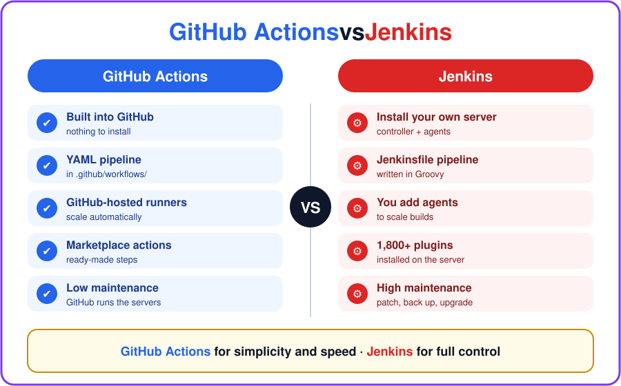

| Point           | Jenkins                                | GitHub Actions                           |
| --------------- | -------------------------------------- | ---------------------------------------- |
| **Setup**       | Install + maintain your own server     | Nothing to install — built into GitHub   |
| **Pipeline**    | `Jenkinsfile` (Groovy)                 | YAML in `.github/workflows/`             |
| **Servers**     | You manage controller + agents         | GitHub-hosted runners (or self-hosted)   |
| **Extensions**  | Plugins (installed on the server)      | Actions from Marketplace (used per step) |
| **Integration** | Needs webhooks + GitHub plugin         | Native — PRs, issues, releases, checks   |
| **Scaling**     | You add agents yourself                | GitHub scales automatically              |
| **Cost**        | Free software, but you pay for servers | Free minutes per plan, pay for extra     |

> **Interview answer:** "Our code is already on GitHub, so GitHub Actions gives us CI/CD with **no
> server to maintain**. Pipelines are simple **YAML** stored with the code, we get **ready-made
> actions** from the Marketplace, and it's **natively integrated** with PRs and issues. Jenkins is
> still good when you need **full control, on-prem setups, or very complex pipelines** — and GitHub
> Actions covers that too with **self-hosted runners**."

## 5. What is GitHub Actions?

GitHub Actions is GitHub's **built-in CI/CD and automation platform**. You write a **YAML file** in
your repo, and when something happens (push, pull request, etc.), GitHub **runs it automatically**
to build, test, and deploy your code.

> **Interview one-liner:** An **event** triggers a **workflow**. The workflow has **jobs**. Each job
> runs on a **runner** and has **steps**. A step is a shell command (`run`) or an **action**
> (`uses`).

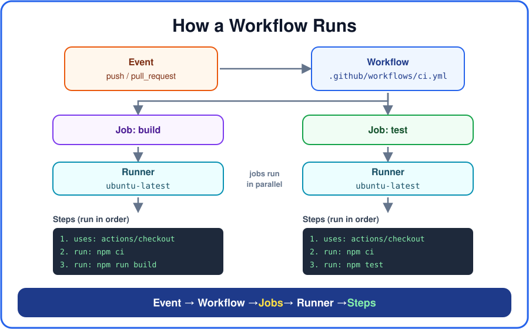

In the repo's **Actions** tab, every workflow run is listed with its status: ✅ success,
❌ failure, or 🟡 in progress. Click a run to see each job and the live log of every step.

**GitHub manages the servers for you** — setup, scaling, and maintenance. You only write the
workflow. Runners are available on **Ubuntu, Windows, and macOS**.

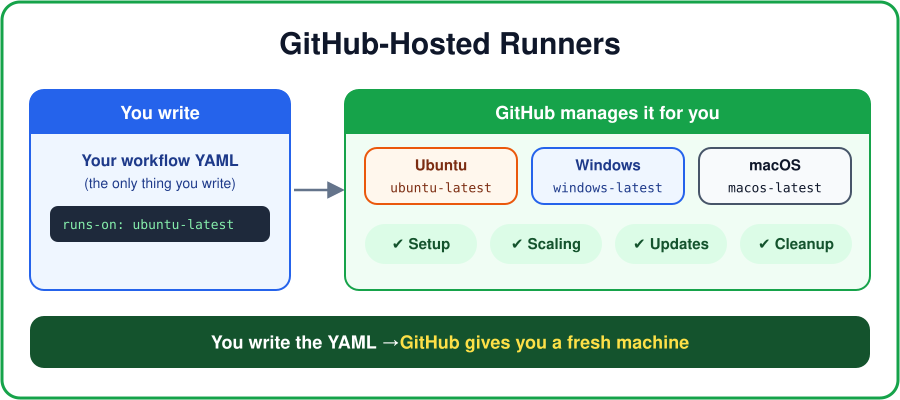

## 6. Not Just CI/CD

GitHub Actions can do **more than build, test, and deploy**. It can also automate everyday work in
the repo.

**1. CI/CD:** `git push` → build → test → lint → dockerize → security scan → deploy.

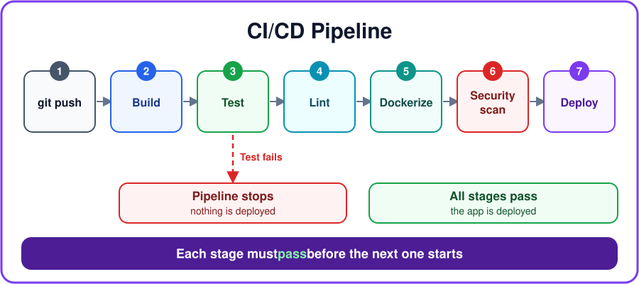

**2. Repo automation:** any **event** in the repo can start a workflow, not only a push.

| When this happens           | The workflow can…                                    |
| --------------------------- | ---------------------------------------------------- |
| New pull request opened     | Post a welcome comment, add labels, assign reviewers |
| New issue opened            | Add a label like `bug` or `triage`                   |
| Release published           | Publish the package                                  |
| Schedule (cron), e.g. night | Run a security scan, clean up old branches           |

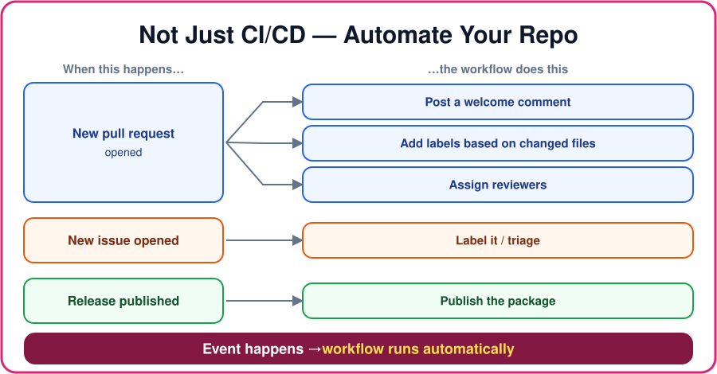

**Example — label every new issue** (no push, no build):

```yaml
on:
  issues:
    types: [opened] # runs when someone opens an issue

jobs:
  label:
    runs-on: ubuntu-latest
    permissions:
      issues: write
    steps:
      - run: gh issue edit ${{ github.event.issue.number }} --add-label "triage"
        env:
          GH_TOKEN: ${{ github.token }}
          GH_REPO: ${{ github.repository }}
```

> **Interview one-liner:** GitHub Actions is not only CI/CD. It's an automation tool for the whole
> repo. Any event (PR, issue, release, schedule) can trigger a workflow that does the work for you.

## 7. Core Components

```text
Event ──► Workflow ──► Job(s) ──► runs on Runner ──► Step(s)
                                                     ├─ run:  shell command
                                                     └─ uses: action
```

| Term         | Simple meaning                                     | YAML key   |
| ------------ | -------------------------------------------------- | ---------- |
| **Workflow** | The automation file in `.github/workflows/*.yml`   | `name:`    |
| **Event**    | What starts the workflow (push, PR, schedule, …)   | `on:`      |
| **Job**      | A group of steps that run on one machine           | `jobs:`    |
| **Step**     | One task — a command or an action                  | `steps:`   |
| **Action**   | Ready-made reusable step (e.g. `actions/checkout`) | `uses:`    |
| **Runner**   | The machine (VM) that runs the job                 | `runs-on:` |
| **Matrix**   | Run the same job with many combos (OS × version)   | `matrix:`  |
| **Needs**    | Make one job wait for another                      | `needs:`   |

### 7.1 Workflow

A workflow is an **automated process that runs one or more jobs**. It's a **YAML file** stored in
**`.github/workflows/`** (`.yml` or `.yaml`). A repo can have **many workflows** — e.g. one to
test PRs, one to deploy on release, one to label new issues. One workflow can also **reuse another
workflow**.

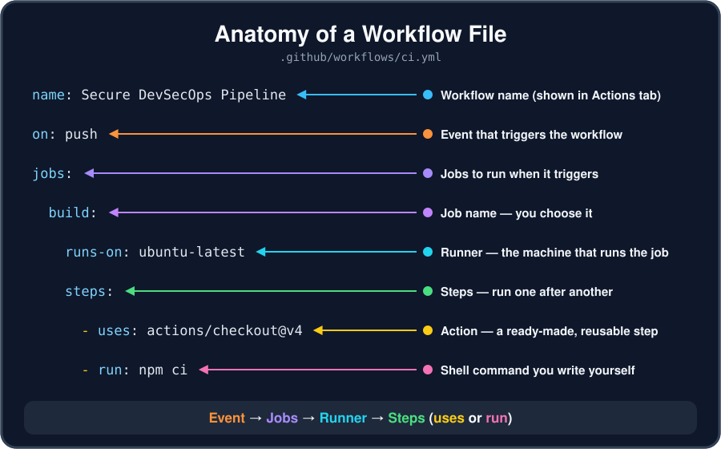

### 7.2 Events

An event is **an activity that starts a workflow** — like a push, a pull request, or an opened
issue. Workflows can also run on a **schedule** (cron), **manually** (`workflow_dispatch`), or from
an **API call** (`repository_dispatch`).

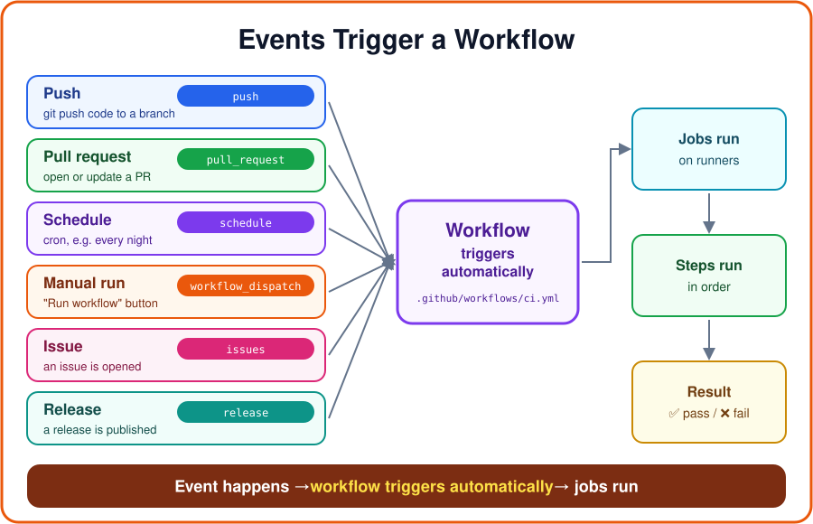

```yaml
name: My Awesome App
on:
  push: # on every push
  pull_request: # on PRs to main
    branches: [main]
  schedule: # every day at midnight (UTC)
    - cron: '0 0 * * *'
  workflow_dispatch: # manual "Run workflow" button
```

### 7.3 Jobs

A job is a **set of steps that run on the same runner**. **Jobs run in parallel** by default; use
**`needs:`** to make a job wait for another. A **matrix** runs the same job for many combinations
(e.g. 3 OS × 2 Node versions = 6 runs). Different jobs run on different machines, so they **share
data using artifacts**.

**Parallel vs sequential** (very common interview question):

|              | Parallel                          | Sequential                        |
| ------------ | --------------------------------- | --------------------------------- |
| **How**      | Jobs run **at the same time**     | Jobs run **one after another**    |
| **Keyword**  | Nothing (default)                 | `needs:`                          |
| **Speed**    | Faster                            | Slower, but keeps the right order |
| **Use when** | Jobs are independent              | A job depends on another's result |
| **Example**  | lint + unit tests + security scan | build → test → deploy             |

```yaml
jobs:
  lint: # lint, test, codeql have no needs → run in PARALLEL
  test:
  codeql:
  deploy:
    needs: [lint, test, codeql] # SEQUENTIAL: waits for all three
```

#### Matrix Jobs

**Matrix = same job, many setups.** You write a job **once**, give it a list of values (like
operating systems and Node versions), and GitHub runs the job **once for every combination**, all
**at the same time**.

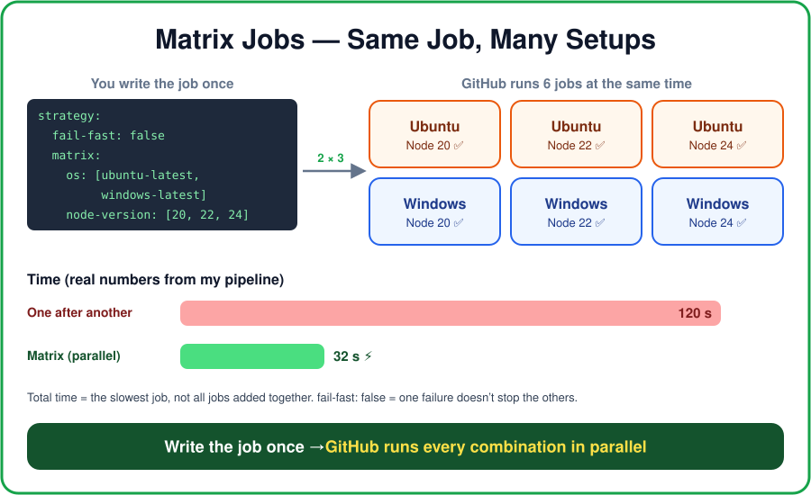

**Without a matrix:** to test on 2 OS × 3 Node versions, you'd copy-paste the same job **6 times**.
**With a matrix:** you write it **once**:

```yaml
jobs:
  test:
    runs-on: ${{ matrix.os }} # filled in for each job
    strategy:
      fail-fast: false # one failure doesn't stop the others
      matrix:
        os: [ubuntu-latest, windows-latest] # 2 values
        node-version: [20, 22, 24] # 3 values
    steps:
      - uses: actions/checkout@v4
      - uses: actions/setup-node@v4
        with:
          node-version: ${{ matrix.node-version }} # filled in for each job
      - run: npm ci
      - run: npm test
```

GitHub creates **2 × 3 = 6 jobs** and runs them in parallel:

|                    | Node 20 | Node 22 | Node 24 |
| ------------------ | ------- | ------- | ------- |
| **ubuntu-latest**  | job 1   | job 2   | job 3   |
| **windows-latest** | job 4   | job 5   | job 6   |

- **`matrix:`** lists the values. Each key (`os`, `node-version`) is a variable.
- **`${{ matrix.os }}`** / **`${{ matrix.node-version }}`** are replaced with each job's values.
- **`fail-fast`**: `true` (default) cancels the other jobs when one fails. `false` lets them all
  finish, so you see every failure.
- **`include`** adds an extra combination, and **`exclude`** removes one. Example: skip
  Windows + Node 20:

  ```yaml
  matrix:
    os: [ubuntu-latest, windows-latest]
    node-version: [20, 22, 24]
    exclude:
      - os: windows-latest
        node-version: 20
  ```

**Why use it?**

- **Test everywhere:** proves the app works on every OS and version users might have.
- **No copy-paste:** one job definition instead of many.
- **Saves time:** all combinations run **in parallel**. In this repo, 6 test jobs took **32
  seconds** instead of **120 seconds** one after another.

> **Interview one-liner:** "A matrix runs the same job many times with different settings, like
> different operating systems or language versions, all in parallel. Matrix = same job, many
> setups."

### 7.4 Steps

Steps are the **individual tasks inside a job** — either a **shell command (`run`)** or an
**action (`uses`)**. They run **one after another** on the same machine, so they **share files** —
e.g. step 1 builds the app, step 2 tests the built output.

```yaml
jobs:
  unit-testing:
    strategy:
      matrix: # 3 OS × 2 versions = 6 runs
        os: [ubuntu-latest, macos-latest, windows-latest]
        node-version: [18, 20]
    runs-on: ${{ matrix.os }}
    steps:
      - uses: actions/checkout@v7 # get the code
      - uses: actions/setup-node@v7 # install Node.js
        with:
          node-version: ${{ matrix.node-version }}
      - run: npm ci # install dependencies
      - run: npm test # run tests

  deploy:
    needs: unit-testing # runs only after all tests pass
    runs-on: ubuntu-latest
    steps:
      - run: echo "Deploying..."
```

### 7.5 Actions

An action is a **ready-made, reusable piece of code** for a common task, so you don't write the
same steps again. Examples: `actions/checkout` (get code), `actions/setup-node` (install Node),
`aws-actions/configure-aws-credentials` (cloud login). Get them from the **GitHub Marketplace** or
write your own, and always **pin the version** (`@v7` or a commit SHA).

### 7.6 Runners

A runner is the **server that runs your job** — one job at a time. **GitHub-hosted runners**
(Ubuntu, Windows, macOS) give a **fresh, clean VM for every run**, so nothing is saved between runs
(use cache/artifacts). **Self-hosted runners** are your own machines, for custom OS, hardware, or
private network access.

**Self-hosted = your machine, GitHub controls the workflow.** You install the runner app on your
server (Settings → Actions → Runners → New runner). Then you pick it with `runs-on: self-hosted`, or
with labels like `runs-on: [self-hosted, linux, gpu]`. Unlike GitHub-hosted runners, it **is not
cleaned after each job**: old files and caches stay unless you clean them.

> ⚠️ **Don't use self-hosted runners on public repos.** Anyone can open a PR from a fork and run
> their code on your machine.

**`ubuntu-slim`** is a small, cheap GitHub-hosted runner with **1 CPU and 5 GB RAM**. It runs in a
**container, not a full VM**, and has **few tools installed**. A job on it is **stopped after 15
minutes**. Good for small jobs (labels, notifications), not for heavy builds or Docker.

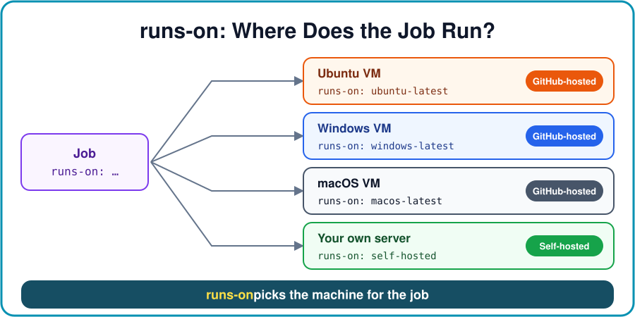

|                   | GitHub-hosted                      | Self-hosted                       |
| ----------------- | ---------------------------------- | --------------------------------- |
| **Where**         | GitHub's cloud                     | Your own server / cloud           |
| **Customization** | Only pre-installed tools           | Full control (GPU, custom OS…)    |
| **Cost**          | Free minutes in plan, limits apply | You pay for servers + maintenance |
| **Managed by**    | GitHub                             | You                               |

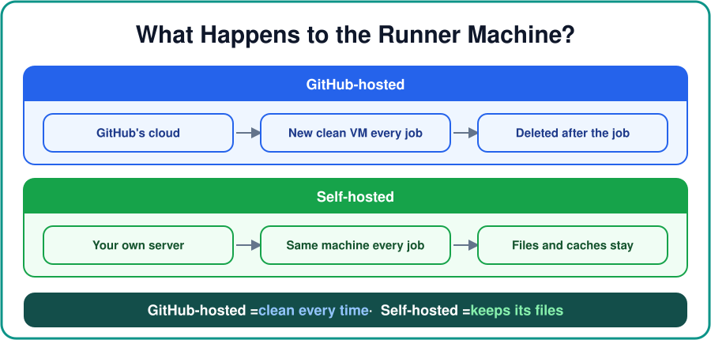

> ⚠️ GitHub-hosted runners have **usage limits** based on your plan — check
> [Billing settings](https://github.com/settings/billing).

## 8. package.json vs package-lock.json

**`package.json`** is the **project's ID card**, and you edit it yourself. It has the app's name,
version, **scripts** (`npm test`, `npm run build`) and the **dependencies** it needs. Versions are
**ranges**: `"eslint": "^9.39.5"` means "9.39.5 or any newer 9.x". So two installs on different days
can give **different versions**.

**`package-lock.json`** is **created automatically by npm**. It locks the **exact version of every
package**, including dependencies of dependencies, plus a hash to verify each download. **Commit
it to Git**, so every developer and every CI run installs the **exact same versions**.

```text
// package.json  →  "what I want"
"devDependencies": { "eslint": "^9.39.5" }

// package-lock.json  →  "exactly what was installed"
"node_modules/eslint": { "version": "9.39.5", "integrity": "sha512-..." }
```

| Point              | `npm install`                        | `npm ci` (use in CI)                        |
| ------------------ | ------------------------------------ | ------------------------------------------- |
| **Reads**          | `package.json` (can update the lock) | `package-lock.json` only (never changes it) |
| **If out of sync** | Updates the lock file                | **Fails** with an error                     |
| **node_modules**   | Keeps it and adds to it              | **Deletes it** and installs fresh           |
| **Use for**        | Local development, adding packages   | CI pipelines — clean, exact, faster         |

> **Interview answer:** "`package.json` lists the dependencies with version ranges, and
> `package-lock.json` locks the exact versions. In CI we use `npm ci`, which installs exactly what's
> in the lock file, so the build is the same every time."

### 8.1 Dependencies vs node_modules vs Cache vs Artifact — NOT the same!

These words are easy to mix up. They are **all different**.

**The story, step by step:**

1. **`package.json`** says **what libraries you need**, like a **shopping list** (e.g. "express,
   version 4 or newer").
2. **`package-lock.json`** says **the exact version** of each one, like a **receipt** (e.g.
   "express 4.18.2").
3. **`npm ci`** (or `npm install`) **downloads** those libraries and puts them in the
   **`node_modules/`** folder. It **does not compile** anything. It only downloads and unzips.
4. The libraries inside `node_modules/` are called **dependencies**. They are **other people's
   code** that your app uses.
5. **`npm run build`** takes **your own code** and makes the **build output**, usually a **`dist/`**
   folder. This is your app, ready to run.
6. **`actions/upload-artifact`** uploads `dist/` to **GitHub**. Now it is an **artifact**.

```text
package.json + package-lock.json     →  "what to download"
        │ npm ci (download only)
        ▼
node_modules/                         →  dependencies (other people's code), stays on the machine
        │ npm run build (uses YOUR code)
        ▼
dist/                                 →  build output (YOUR app)
        │ actions/upload-artifact
        ▼
Artifact on GitHub                    →  deploy job or a person downloads it
```

| Word                 | Simple meaning                                       | Where is it?                       |
| -------------------- | ---------------------------------------------------- | ---------------------------------- |
| `package.json`       | List of libraries you need                           | In your repo (Git)                 |
| `package-lock.json`  | Exact versions of those libraries                    | In your repo (Git)                 |
| **Dependencies**     | The libraries themselves (other people's code)       | Inside `node_modules/`             |
| **`node_modules/`**  | The folder that holds the dependencies               | On the machine only (not in Git)   |
| **Cache (`~/.npm`)** | npm's saved downloads, to make the next run faster   | Saved by `actions/cache`           |
| **Artifact**         | Files you upload after a job — your **build output** | **On GitHub**, in the workflow run |

**Your questions answered:**

- **"Are dependencies and artifacts the same?"** **No.** Dependencies = **other people's
  libraries** you download. Artifact = **your own app's output** that you upload.
- **"Does `npm install` compile everything into one folder?"** **No.** It only **downloads** the
  libraries into `node_modules/`. Nothing is compiled. Building is a separate step
  (`npm run build`).
- **"Is the artifact stored in `node_modules/`?"** **No.** `node_modules/` is only on the runner
  machine, and it's deleted when the job ends. The artifact is stored **on GitHub**, and only if you
  upload it.
- **"Is `node_modules/` uploaded as an artifact?"** **Usually no.** It's big, and anyone can
  recreate it with `npm ci`. It's also not in Git (it's in `.gitignore`).
- **"Then how does the app get its libraries on the server?"** At deploy time you either run
  `npm ci --omit=dev` on the server, or build a **Docker image** that contains your app plus its
  libraries. Then the Docker image is the thing you deploy.

**In this repo:** `npm run build` runs `mkdir -p dist && cp -r src/. dist/`. So `dist/` is the
build output, and that is what we upload as the artifact.

> **Interview answer:** "`package.json` lists the dependencies and `package-lock.json` locks their
> exact versions. `npm ci` only **downloads** them into `node_modules/` — it doesn't compile. The
> cache makes that download faster. `npm run build` creates our app's build output like `dist/`,
> and **that** is what we upload as an **artifact** — it's stored on GitHub, not in
> `node_modules/`."

## 9. Caching

Every job starts on a **fresh VM**, so dependencies are **downloaded again on every run**, which is
slow. A **cache** saves files (like `~/.npm`) after one run and **restores them in the next run**,
which makes builds faster. The cache is found by its **key**. The key usually contains a **hash of
`package-lock.json`**, so when dependencies change, the key changes and a new cache is made.

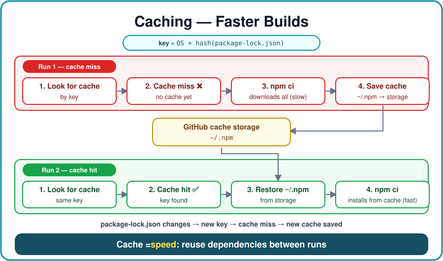

**Easy way** — `setup-node` caches npm for you:

```yaml
- uses: actions/setup-node@v7
  with:
    node-version: 20
    cache: npm # caches ~/.npm, key based on package-lock.json
```

**Manual way** — `actions/cache` (works for any tool: pip, Maven, Gradle, Docker layers…):

```yaml
- uses: actions/cache@v6
  with:
    path: ~/.npm # what to save
    key: ${{ runner.os }}-npm-${{ hashFiles('**/package-lock.json') }} # exact match
    restore-keys: ${{ runner.os }}-npm- # fallback: closest older cache
```

- **Cache hit** = key found, files restored. **Cache miss** = files downloaded, then saved for next
  time.
- Caches **not used for 7 days are deleted**, and each repo has a **size limit (10 GB by
  default)**.
- **Never cache secrets.** Cache dependencies, not build results.

## 10. Artifacts

Artifacts are **files a workflow saves after a job finishes**: build output (`dist/`), test reports,
logs, coverage reports. Use them to **share files between jobs**, because each job runs on a
different VM. You can also **download them from the run's page** in the Actions tab. By default they
are **kept for 90 days**, and you can change this with `retention-days`.

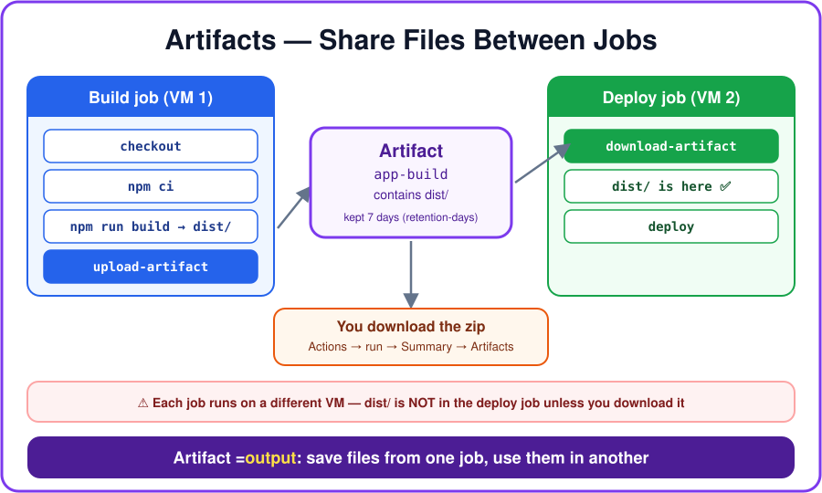

```yaml
jobs:
  build:
    runs-on: ubuntu-latest
    steps:
      - uses: actions/checkout@v7
      - run: npm ci && npm run build
      - uses: actions/upload-artifact@v7 # SAVE files
        with:
          name: app-build
          path: dist/
          retention-days: 7

  deploy:
    needs: build
    runs-on: ubuntu-latest # different VM — dist/ is NOT here
    steps:
      - uses: actions/download-artifact@v8 # GET files from build job
        with:
          name: app-build
          path: dist/
      - run: ls dist/
```

### Cache vs Artifact

|                 | Cache                                | Artifact                                      |
| --------------- | ------------------------------------ | --------------------------------------------- |
| **Purpose**     | **Speed up** runs                    | **Keep / share output** of a run              |
| **What**        | Dependencies (`~/.npm`, pip, Maven)  | Build output, test reports, logs              |
| **Used across** | **Different workflow runs**          | **Jobs in the same run** + download by people |
| **Action**      | `actions/cache` / `setup-node cache` | `upload-artifact` / `download-artifact`       |
| **Kept for**    | Deleted if unused for 7 days         | 90 days by default (`retention-days`)         |

> **Interview answer:** "A cache is for **speed**: it reuses dependencies between workflow runs. An
> artifact is for **output**: it saves files a job produced, so another job can use them or a person
> can download them."

## 11. Conditions & Status Check Functions

**Conditions** (`if:`) decide **whether a job or step runs**, based on the branch, the event, or
earlier results. Remember it as **"Should I run?"**

```yaml
- name: Deploy
  if: github.ref == 'refs/heads/main' && github.event_name == 'push' # only pushes to main
  run: ./deploy.sh
```

**Status check functions** are used inside `if:` to check **what happened to earlier steps or
jobs**. Remember it as **"What happened before me?"**

| Function       | Runs when…                                                | Use for                        |
| -------------- | --------------------------------------------------------- | ------------------------------ |
| `success()`    | All earlier steps passed (**the default**)                | Normal steps                   |
| `failure()`    | An earlier step failed                                    | Rollback, alerts, upload logs  |
| `cancelled()`  | The workflow was cancelled                                | Cleanup                        |
| `always()`     | Always — even after a failure or cancel                   | Must-run cleanup, test reports |
| `!cancelled()` | Always, **except** when cancelled (safer than `always()`) | Upload test results            |

```yaml
- name: Rollback
  if: failure() # runs only if a previous step failed
  run: echo "rollback is done"
```

- **Manual approval** before production is **not** done with `if:`. Use an **environment with
  required reviewers** (`environment: production`), and the job waits until someone approves.
- **Two meanings of "status checks":** (1) these **functions** inside a workflow, and (2) the
  **✅/❌ checks shown on a PR**. With **branch protection**, you can make PRs wait until the
  required checks pass before they can be merged.

## 12. CodeQL (Security Scanning)

CodeQL is GitHub's **code scanning tool (SAST: Static Application Security Testing)**. It reads your
**source code** and finds **security vulnerabilities** like **SQL injection, XSS, and command
injection**, without running the app. Results show up in the **Security tab → Code scanning** and
on PRs. It's **free for public repos**; private repos need **GitHub Code Security** (Advanced
Security).

**Flow:** Source code → CodeQL builds a database of the code → runs security queries → alerts in
the Security tab.

**Testing vs CodeQL:**

|              | Testing                             | CodeQL                                |
| ------------ | ----------------------------------- | ------------------------------------- |
| **Question** | "**Does it work?**"                 | "**Is the code secure?**"             |
| **Checks**   | Functionality                       | Security                              |
| **Finds**    | Bugs                                | Vulnerabilities                       |
| **Examples** | Unit, integration, functional tests | SQL injection, XSS, command injection |

```yaml
codeql:
  runs-on: ubuntu-latest
  permissions:
    security-events: write # needed to upload results to the Security tab
    contents: read
  steps:
    - uses: actions/checkout@v7
    - uses: github/codeql-action/init@v4
      with:
        languages: javascript-typescript # JS needs no build → no autobuild step
    - uses: github/codeql-action/analyze@v4
```

> **Interview answer:** "Testing checks that the app **works**, and CodeQL checks that the code is
> **secure**. We run CodeQL in CI as its **own job, in parallel** with the tests, and the results
> show up in the **Security tab**."

## 13. Dependabot

Dependabot is a GitHub tool that **keeps your dependencies updated and secure**. It checks your
packages (npm, pip, Docker, GitHub Actions…). When there's a **newer or safer version**, it **opens
a PR automatically**. You review the PR, and CI runs on it before you merge.

**Flow:** your app uses Express 4.18 → a secure new version comes out → Dependabot opens a PR → CI
passes → you merge.

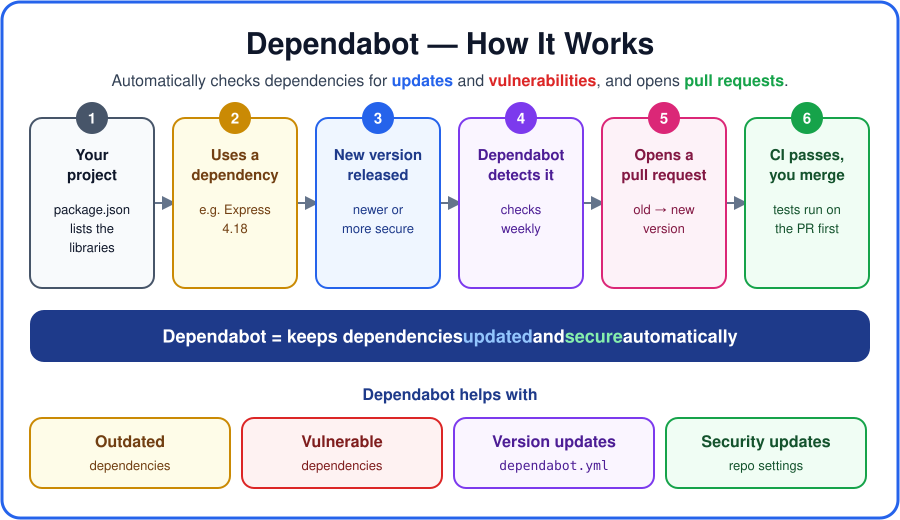

| Feature               | What it does                                          | Config                   |
| --------------------- | ----------------------------------------------------- | ------------------------ |
| **Dependabot alerts** | Warns you about vulnerable dependencies               | Turn on in repo settings |
| **Security updates**  | Opens a PR to fix vulnerable ones                     | Turn on in repo settings |
| **Version updates**   | Opens PRs to keep everything up to date on a schedule | `.github/dependabot.yml` |

```yaml
# .github/dependabot.yml
version: 2
updates:
  - package-ecosystem: 'npm'
    directory: '/'
    schedule:
      interval: 'weekly'
  - package-ecosystem: 'github-actions' # also updates actions/checkout@vX etc.
    directory: '/'
    schedule:
      interval: 'weekly'
```

## 14. Cost & Build Optimization

**Faster pipelines = cheaper pipelines** (you pay per runner minute).

| Strategy                   | Simple meaning                            | How                                                        |
| -------------------------- | ----------------------------------------- | ---------------------------------------------------------- |
| **Right-size runners**     | Right machine for the job                 | Small job → `ubuntu-slim`; heavy build → larger runner     |
| **Caching**                | Don't download/build the same thing again | `actions/cache`, `setup-node cache`, Docker layer cache    |
| **Parallelize**            | Run independent jobs together             | No `needs:` between lint, test, scan                       |
| **Change-aware pipeline**  | Run only what changed                     | `paths:` filters — docs change → skip app tests            |
| **Optimize Docker builds** | Smaller, faster images                    | Multi-stage builds, `.dockerignore`, small base images     |
| **Optimize tests**         | Cheap tests first, expensive later        | Unit tests on every PR; E2E only on main / before release  |
| **Build once, promote**    | Don't rebuild for every environment       | Build one artifact, deploy the same one to dev → QA → prod |

```yaml
on:
  push:
    paths-ignore: ['**.md', 'docs/**'] # docs-only change → workflow doesn't run
```

## 15. Security Strategies (Simple Terms)

| #   | Area                    | One word    | In simple words                                                                                                                                                                                                             |
| --- | ----------------------- | ----------- | --------------------------------------------------------------------------------------------------------------------------------------------------------------------------------------------------------------------------- |
| 1   | **Identity & secrets**  | **Trust**   | Don't save permanent cloud passwords/keys in GitHub. Use **OIDC**: GitHub gets a **temporary token** from AWS/Azure/GCP for each run, and it expires on its own. Give it the **least permissions** needed.                  |
| 2   | **Code & dependencies** | **Scan**    | Find problems **before** production: **CodeQL** (your code), **Dependabot** (libraries), **secret scanning** (leaked keys), **IaC scanning** (Terraform/K8s files). Block only serious issues, not every small warning.     |
| 3   | **Artifacts**           | **Prove**   | Prove the artifact is real and unchanged: **SBOM** (a list of everything inside), **signing** (a digital seal), **provenance** (a record of who built it, from which commit). Build once, deploy the same one.              |
| 4   | **Pipeline & runners**  | **Isolate** | CI runners can reach secrets, so protect them. Use **fresh, temporary runners**, keep untrusted PR code away from secrets, and use **protected branches/environments**.                                                     |
| 5   | **Policy & deployment** | **Gate**    | Security rules are **checked automatically** before deploying, not by someone remembering a checklist. Use **approval gates**, **branch protection**, **policy-as-code**, and "block if a critical vulnerability is found". |

Also set **`permissions:`** in every workflow to give the `GITHUB_TOKEN` only what it needs
(e.g. `contents: read`).

## 16. GitHub Copilot

GitHub Copilot is an **AI coding assistant**. It helps developers and DevOps engineers **write,
understand, fix, and improve code**. In GitHub Actions work, you can use it to **write workflow
YAML**, **explain** an existing workflow or command, **debug** a failed run from its logs, and write
**scripts and tests**. **Always review what it writes** — check action versions, permissions, and
secrets yourself.

## 17. Example — Node.js CI Workflow

A typical CI pipeline in `.github/workflows/ci.yml`. Explain it in an interview like this:

```yaml
name: Node.js CI # WORKFLOW name (shown in Actions tab)

on: # EVENTS
  push:
    branches: [main]
  pull_request:
    branches: [main]
  workflow_dispatch: # manual run

jobs:
  build: # JOB
    runs-on: ubuntu-latest # RUNNER (fresh VM)
    steps: # STEPS (run in order)
      - uses: actions/checkout@v7 # ACTION: clone the repo
      - uses: actions/setup-node@v7 # ACTION: install Node + cache npm
        with:
          node-version: 20
          cache: npm
      - run: npm ci # install exact dependencies
      - run: npm run lint # check code quality
      - run: npm test # run tests
      - run: npm run build # build the app
      - uses: actions/upload-artifact@v7 # ARTIFACT: save dist/ for download
        with:
          name: app-build
          path: dist/
```

## 18. Remember These

- Workflow files live in **`.github/workflows/`**.
- **Jobs = parallel**, **steps = sequential**.
- `run:` = shell command, `uses:` = action.
- Each job gets a **fresh VM**; jobs share data via **artifacts**.
- **Pin action versions** (`@v7`) for safe, repeatable builds.
- Use **`npm ci`** in CI (exact versions from the lock file), and **commit `package-lock.json`**.
- **Cache = speed** (reused between runs). **Artifact = output** (shared between jobs / downloaded).
- `if:` = **"Should I run?"**; `failure()` / `always()` = **"What happened before me?"**
- **Testing = does it work?** **CodeQL = is it secure?** **Dependabot = are my libraries safe and
  up to date?**
- Use **OIDC** instead of storing cloud keys, and set least-privilege **`permissions:`**.

**Next steps:** [Workflow templates](https://docs.github.com/en/actions/writing-workflows/using-workflow-templates)
· [CI tutorials](https://docs.github.com/en/actions/use-cases-and-examples/building-and-testing)
[Deployment](https://docs.github.com/en/actions/use-cases-and-examples/deploying)
[GitHub Actions certification](https://resources.github.com/learn/certifications/)
