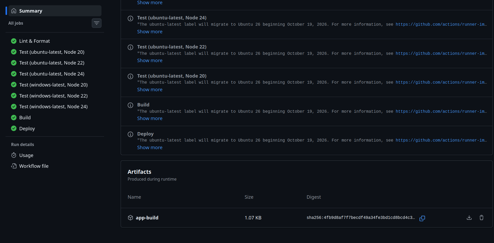
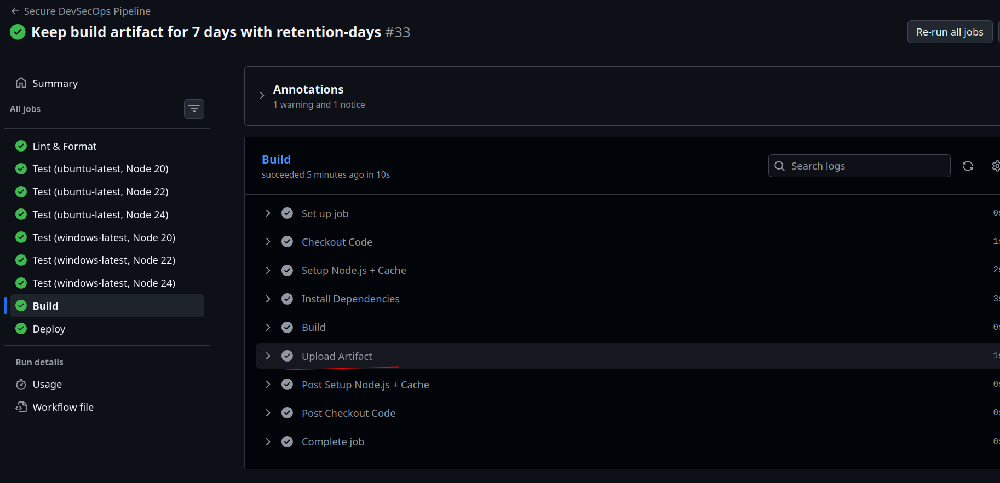
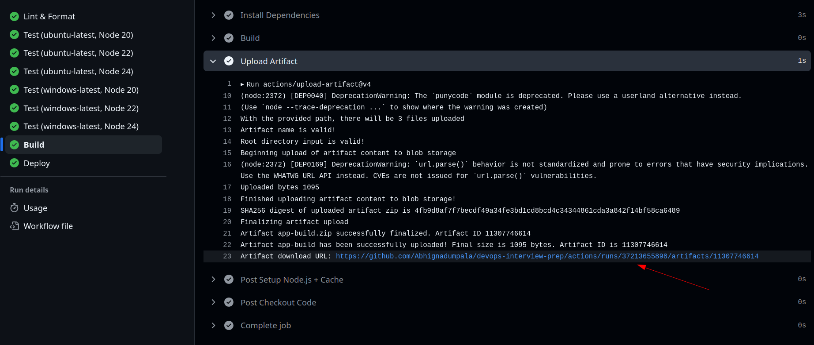

# Day 2 — Cache, Dependabot, Matrix Jobs, Conditions, Status Check

[← Day 1](../day-1/README.md) · [All notes](../README.md) · [Day 3 →](../day-3/README.md)

- **Cache:** saved npm packages between runs, so `npm ci` is faster.
- **Jobs with `needs:`:** split the pipeline into lint → test → build → deploy.
- **Matrix jobs:** ran the tests on 2 operating systems × 3 Node versions (6 runs).
- **Conditions:** deploy only on a push to `main`, and rollback only if deploy fails.
- **Dependabot:** `.github/dependabot.yml` checks for library updates every week.
- **Status check:** made the pipeline a required check, so a PR can't merge until it passes.

## The Full Day 2 Workflow

`.github/workflows/ci.yml`

```yaml
name: Secure DevSecOps Pipeline

on:
  push:
    branches:
      - master
      - main
  pull_request: # also run on PRs, so the status check shows on the PR
    branches:
      - main
  workflow_dispatch:

permissions:
  contents: read

jobs:
  # 1. LINT: check code quality and formatting (once)
  lint:
    name: Lint & Format
    runs-on: ubuntu-latest
    steps:
      - name: Checkout Code
        uses: actions/checkout@v4

      - name: Setup Node.js + Cache # CACHE: saves ~/.npm, key = hash of package-lock.json
        uses: actions/setup-node@v4
        with:
          node-version: 22
          cache: npm

      - name: Install Dependencies
        run: npm ci

      - name: Lint
        run: npm run lint

      - name: Format Check
        run: npm run format:check

  # 2. TEST: MATRIX → 2 OS × 3 Node versions = 6 jobs in parallel
  test:
    name: Test (${{ matrix.os }}, Node ${{ matrix.node-version }})
    needs: lint # starts only after lint passes
    runs-on: ${{ matrix.os }}
    strategy:
      fail-fast: false # if one combination fails, the others keep running
      matrix:
        os: [ubuntu-latest, windows-latest]
        node-version: [20, 22, 24]
    steps:
      - name: Checkout Code
        uses: actions/checkout@v4

      - name: Setup Node.js + Cache
        uses: actions/setup-node@v4
        with:
          node-version: ${{ matrix.node-version }}
          cache: npm

      - name: Install Dependencies
        run: npm ci

      - name: Test
        run: npm run test:ci

  # 3. BUILD: create dist/ and save it as an artifact
  build:
    name: Build
    needs: test # waits for ALL 6 matrix jobs to pass
    runs-on: ubuntu-latest
    steps:
      - name: Checkout Code
        uses: actions/checkout@v4

      - name: Setup Node.js + Cache
        uses: actions/setup-node@v4
        with:
          node-version: 22
          cache: npm

      - name: Install Dependencies
        run: npm ci

      - name: Build
        run: npm run build

      - name: Upload Artifact
        uses: actions/upload-artifact@v4
        with:
          name: app-build
          path: dist/
          retention-days: 7 # delete the artifact after 7 days (default is 90)

  # 4. DEPLOY: CONDITIONS → only on a push to main, rollback only on failure
  deploy:
    name: Deploy
    needs: build
    if: github.ref == 'refs/heads/main' && github.event_name == 'push'
    runs-on: ubuntu-latest
    steps:
      - name: Download Artifact
        uses: actions/download-artifact@v4
        with:
          name: app-build
          path: dist/

      - name: Deploy
        run: echo "code is deployed"

      - name: Rollback
        if: failure() # runs only if a step above failed
        run: echo "rollback is done"
```

**Flow:**

```
lint ──→ test (6 matrix jobs in parallel) ──→ build ──→ deploy (main only)
                                                          └─ rollback (if deploy fails)
```

## Result

This workflow is the live `.github/workflows/ci.yml`. On a push to `main`, **all 9 jobs passed**:

| Job                                          | Result   |
| -------------------------------------------- | -------- |
| Lint & Format                                | ✅       |
| Test (ubuntu-latest, Node 20 / 22 / 24)      | ✅ ✅ ✅ |
| Test (windows-latest, Node 20 / 22 / 24)     | ✅ ✅ ✅ |
| Build (uploaded artifact `app-build`)        | ✅       |
| Deploy (ran because it was a push to `main`) | ✅       |

## Artifact — Name, Path and Where to Find It

| What                | Value                                                          |
| ------------------- | -------------------------------------------------------------- |
| Artifact name       | **`app-build`** (set by `name:` in the Upload Artifact step)   |
| Folder uploaded     | **`dist/`** (set by `path:`)                                   |
| Who creates `dist/` | `npm run build` → `mkdir -p dist && cp -r src/. dist/`         |
| Uploaded by job     | **Build** (`actions/upload-artifact@v4`)                       |
| Downloaded by job   | **Deploy** (`actions/download-artifact@v4`), back into `dist/` |
| Size                | About **1 KB** (zipped)                                        |
| Kept for            | **7 days** (`retention-days: 7`), then deleted automatically   |

**Retention days:** how long GitHub keeps the artifact before deleting it.

```yaml
- uses: actions/upload-artifact@v4
  with:
    name: app-build
    path: dist/
    retention-days: 7
```

- Default is **90 days**. Allowed: **1 to 90** on public repos (up to 400 on private repos), and never more than the repo setting.
- Shorter = **less storage used** (artifact storage counts against your GitHub plan).
- Set it per upload. Repo-wide default: **Settings → Actions → General → Artifact and log
  retention**.

**What's inside `app-build`:**

```
app-build.zip
├── app.js                  ← from src/app.js
├── server.js               ← from src/server.js
└── services/
    └── calculator.js       ← from src/services/calculator.js
```

The **contents** of `dist/` go into the zip (not the `dist` folder itself). When Deploy downloads
it with `path: dist/`, the files land back in `dist/` on the deploy runner.

**Where to find it on GitHub (2 ways):**

**Way 1: Summary page**

1. Open the repo → **Actions** tab.
2. Click a workflow run (e.g. the latest push to `main`).
3. On the run's **Summary** page, scroll down to **Artifacts**.
4. Click the **download icon** next to **`app-build`** to download `app-build.zip`.



**Way 2: Build job log**

1. In the run, click the **Build** job → open the **Upload Artifact** step.



2. The last line of the log shows the **Artifact download URL**. Click it to download.



The log also shows: **3 files uploaded** (`app.js`, `server.js`, `services/calculator.js`), final
size **1095 bytes**, and the artifact's **SHA256 digest** (a checksum to check the zip wasn't
changed).

**How it moves through the pipeline:**

```
Build runner                       GitHub storage              Deploy runner
src/ ──npm run build──→ dist/ ──upload──→ app-build ──download──→ dist/ ──→ deploy
```

- `dist/` is in **`.gitignore`**, so it's **never in the repo**. It only exists inside the runner
  and in the artifact.
- Each job runs on a **new, empty runner**. Without the artifact, Deploy would have no `dist/`
  folder to deploy.

## Cache

```yaml
- uses: actions/setup-node@v4
  with:
    node-version: 22
    cache: npm
```

- `cache: npm` saves the npm download folder (`~/.npm`) after the run, and restores it next time.
- The cache **key** is made from a hash of `package-lock.json`. Same lock file → cache is reused.
  Lock file changes → a new cache is made.
- It's the same as writing `actions/cache` yourself, but it finds the right folder on **every OS**
  (Linux, Windows, macOS):

```yaml
- uses: actions/cache@v4
  with:
    path: ~/.npm
    key: ${{ runner.os }}-node-${{ hashFiles('**/package-lock.json') }}
```

- A cache only makes **installs faster**. To pass files **between jobs** (like `dist/`), use
  **artifacts** (upload → download).

## Matrix Jobs

**Matrix = same job, many setups.** You write the job **once**, list the values (OS, Node
versions), and GitHub runs the job for **every combination**.

```yaml
strategy:
  fail-fast: false
  matrix:
    os: [ubuntu-latest, windows-latest]
    node-version: [20, 22, 24]
```

This creates **2 × 3 = 6 jobs**, all running at the same time:

|                    | Node 20 | Node 22 | Node 24 |
| ------------------ | ------- | ------- | ------- |
| **ubuntu-latest**  | ✅      | ✅      | ✅      |
| **windows-latest** | ✅      | ✅      | ✅      |

- `${{ matrix.os }}` and `${{ matrix.node-version }}` are filled in for each job.
- **`fail-fast: false`**: if one job fails, the others still finish, so you see every failure at
  once.

**Why use it?**

- **Test on many setups:** proves the app works on every OS and Node version users might have.
- **No copy-paste:** without a matrix, you'd write 6 almost identical jobs. With it, you write 1.

> **Interview one-liner:** A matrix runs the same job several times with different settings, like
> different operating systems or Node versions. Matrix = same job, many setups.

## Conditions

| Where     | Condition                                                            | Meaning                            |
| --------- | -------------------------------------------------------------------- | ---------------------------------- |
| Job       | `if: github.ref == 'refs/heads/main' && github.event_name == 'push'` | Deploy only on a push to `main`    |
| Step      | `if: failure()`                                                      | Run only if an earlier step failed |
| (default) | `if: success()`                                                      | Run only if everything passed      |
| Step      | `if: always()`                                                       | Run every time (e.g. cleanup)      |

On a **pull request**, lint, test and build run, but deploy is **skipped**, so unmerged code is
never deployed.

### The Deploy Condition

```yaml
deploy:
  needs: build
  if: github.ref == 'refs/heads/main' && github.event_name == 'push'
```

**Deploy runs only when tested code is pushed to `main`.** All 3 must be true (`&&`):

1. `needs: build`: Build passed (so lint and tests passed).
2. `github.ref == 'refs/heads/main'`: the branch is `main`.
3. `github.event_name == 'push'`: it was a push (not a PR or manual run).

| What happened                | Deploy?                       |
| ---------------------------- | ----------------------------- |
| Push to `main`, tests pass   | ✅ runs                       |
| Push to `main`, a test fails | ⚪ skipped (Build didn't run) |
| Push to `master`             | ⚪ skipped (wrong branch)     |
| PR into `main`               | ⚪ skipped (not a push)       |
| Run workflow button          | ⚪ skipped (not a push)       |

**Skipped ≠ failed.** If an `if:` is false, the job is ⚪ skipped and the run still shows ✅.

### Trigger vs Condition

There are two checks, at two levels:

```
1. TRIGGER (on:)     → does the workflow start at all?   no → no run, nothing in Actions
2. CONDITION (if:)   → does this job/step run?           no → run exists, job shows ⚪ skipped
```

**Tested it:** I removed `main` from `on: push: branches` and pushed to `main` (commit `accea71`).
**No run was created at all.** After adding `main` back (`e584b73`), the run started again ✅.

| Commit    | `on: push: branches` | Push to `main` → run? |
| --------- | -------------------- | --------------------- |
| `1a8aac5` | `master`, `main`     | ✅ ran                |
| `accea71` | `master` only        | ❌ **no run**         |
| `e584b73` | `master`, `main`     | ✅ ran                |
| `da3d37b` | `master` only        | ❌ **no run**         |

Tested again with `on: push: branches: [master]` and Deploy's `if:` set to `main` (commit
`da3d37b`): **no run.** The only case where Deploy's `if:` is true (push to `main`) is blocked by
the trigger, so Deploy can **never** run.

**Rule:** the branch in the `if:` must also be in `on:`.

A condition like `if: github.ref == 'refs/heads/staging'` only works if `staging` is **also in
`on:`**. Otherwise a push to `staging` never starts the workflow, so the `if:` is never checked.

### How to Test the Conditions

| #   | What I do                       | `ref` / `event`                         | Expected                                   |
| --- | ------------------------------- | --------------------------------------- | ------------------------------------------ |
| 1   | Push to `main`                  | `refs/heads/main` / `push`              | ✅ Deploy runs, Rollback skipped           |
| 2   | **Actions → Run workflow**      | `refs/heads/main` / `workflow_dispatch` | ⚪ Deploy skipped (not a push)             |
| 3   | Push to `master`                | `refs/heads/master` / `push`            | ⚪ Deploy skipped (wrong branch)           |
| 4   | Open a pull request into `main` | `refs/pull/N/merge` / `pull_request`    | ⚪ Deploy skipped; lint, test, build run   |
| 5   | Break a test in the PR          | —                                       | ❌ Tests fail, ⚪ Build and Deploy skipped |
| 6   | Add `exit 1` to the Deploy step | `refs/heads/main` / `push`              | ❌ Deploy fails, ✅ Rollback runs          |
| 7   | Remove `main` from `on: push`   | —                                       | ❌ No run at all                           |

To see the values, I added a debug step to the build job:

```yaml
- name: Show condition values
  run: echo "ref=${{ github.ref }}  event=${{ github.event_name }}"
```

## Dependabot

`.github/dependabot.yml` (not a workflow: GitHub reads it directly)

```yaml
version: 2
updates:
  - package-ecosystem: 'npm' # libraries in package.json
    directory: '/'
    schedule:
      interval: 'weekly'
    open-pull-requests-limit: 10
    labels:
      - dependencies
      - security
    commit-message:
      prefix: 'deps'

  - package-ecosystem: 'github-actions' # actions/checkout@v4 etc. in workflows
    directory: '/'
    schedule:
      interval: 'weekly'
```

- Every week, Dependabot checks for newer versions and **opens a pull request** for each update.
- That PR runs the pipeline above, so you **see if the update breaks anything** before merging.

## Status Check

Makes the pipeline a **required check**: a PR **can't be merged** until it passes.

1. **Settings → Branches → Add branch protection rule** (or **Settings → Rules → Rulesets**).
2. Branch name pattern: `main`.
3. Tick **Require status checks to pass before merging**.
4. Search and select the checks: `Lint & Format`, each `Test (...)` job, and `Build`.
5. Save.

- The checks appear in the list only **after the workflow has run once**.
- This is why the workflow also runs on **`pull_request`**: the checks run on the PR, and the
  **Merge** button stays blocked until they're ✅.

## Screenshots

<!-- Put screenshots in ./images/ and show them like this:

-->
