# Day 3 — CodeQL (SAST), Self-Hosted Runners

[← Day 2](../day-2/README.md) · [All notes](../README.md)

- **CodeQL (SAST):** scanned my source code for security issues on every push and PR.
- **Self-hosted runners:** set up my own AWS EC2 machine as a runner and ran jobs on it.

<!-- toc -->

## Table of Contents

- [CodeQL — SAST](#codeql--sast)
  - [Testing vs CodeQL](#testing-vs-codeql)
  - [Enable CodeQL in GitHub](#enable-codeql-in-github)
  - [CodeQL Workflow](#codeql-workflow)
  - [What Each Part Does](#what-each-part-does)
  - [Where to See the Results](#where-to-see-the-results)
- [Self-Hosted Runners](#self-hosted-runners)
  - [Why Use Self-Hosted Runners?](#why-use-self-hosted-runners)
  - [GitHub-Hosted vs Self-Hosted](#github-hosted-vs-self-hosted)
  - [Set Up a Self-Hosted Runner on AWS EC2](#set-up-a-self-hosted-runner-on-aws-ec2)
  - [Use the Self-Hosted Runner in a Workflow](#use-the-self-hosted-runner-in-a-workflow)
  - [Things to Remember](#things-to-remember)

<!-- tocstop -->

## CodeQL — SAST

**SAST (Static Application Security Testing)** is an automated code review that finds security
issues in your code **without running it**. **CodeQL** is GitHub's SAST tool.

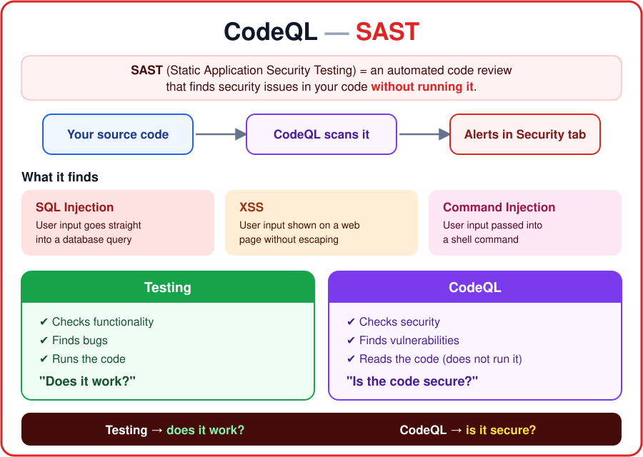

CodeQL checks: **"Does my source code contain security vulnerabilities?"**

Examples of what it finds:

- **SQL Injection** — user input goes straight into a database query
- **XSS (Cross-Site Scripting)** — user input is shown on a web page without escaping
- **Command Injection** — user input is passed into a shell command

### Testing vs CodeQL

| Testing              | CodeQL                |
| -------------------- | --------------------- |
| Checks functionality | Checks security       |
| Finds bugs           | Finds vulnerabilities |
| Runs the code        | Reads the code        |
| "Does it work?"      | "Is the code secure?" |

**Interview one-liner:** Testing validates application functionality, while CodeQL analyzes source
code for potential security vulnerabilities.

### Enable CodeQL in GitHub

1. Open the repo on GitHub → **Settings**.
2. In the left menu, go to **Advanced Security**.
3. Under **Code scanning**, find **CodeQL analysis** → click **Set up**.
4. Choose:
   - **Default** — GitHub scans the code for you, no YAML needed.
   - **Advanced** — GitHub creates a workflow file (`codeql.yml`) that you can edit, like the one
     below.

> Use **one** of them. If Default is on, a CodeQL workflow in YAML fails to upload its results.
> To use your own YAML, switch Default off first.

### CodeQL Workflow

```yaml
name: Secure DevSecOps Pipeline

on:
  push:
    branches:
      - main
      - master
      - develop
      - feature/** # any branch starting with feature/
  pull_request:
    branches:
      - main
      - master
      - develop
  workflow_dispatch:

permissions:
  actions: read
  contents: read
  security-events: write # required to upload findings to the Security tab

jobs:
  codeql:
    name: CodeQL Analysis
    runs-on: ubuntu-latest
    timeout-minutes: 20 # stop the job if it runs longer than 20 min

    strategy:
      fail-fast: false
      matrix:
        language: ['javascript-typescript'] # languages to scan

    defaults:
      run:
        shell: bash

    steps:
      - name: Checkout Repository
        uses: actions/checkout@v4

      - name: Cache Dependencies
        uses: actions/cache@v5
        with:
          path: ~/.npm
          key: ${{ runner.os }}-node-${{ hashFiles('**/package-lock.json') }}
          restore-keys: |
            ${{ runner.os }}-node-

      - name: Install Dependencies
        run: npm ci

      - name: Initialize CodeQL
        uses: github/codeql-action/init@v4
        with:
          languages: ${{ matrix.language }}

      - name: Autobuild
        uses: github/codeql-action/autobuild@v4

      - name: Perform CodeQL Analysis
        uses: github/codeql-action/analyze@v4
        with:
          category: '/language:${{ matrix.language }}'
```

### What Each Part Does

| Part                        | What it does                                                               |
| --------------------------- | -------------------------------------------------------------------------- |
| `push` branches             | Runs on a push to `main`, `master`, `develop`, or any `feature/...` branch |
| `pull_request` branches     | Runs on a PR into `main`, `master`, or `develop`                           |
| `workflow_dispatch`         | Lets you run it by hand from the Actions tab                               |
| `permissions` (top level)   | Applies to every job in the workflow                                       |
| `timeout-minutes: 20`       | Kills the job if it hangs, so it doesn't waste runner minutes              |
| `security-events: write`    | Lets CodeQL upload its findings to the **Security** tab                    |
| `matrix.language`           | Which language to scan. Add more (e.g. `python`) to scan them too          |
| `defaults.run.shell: bash`  | Every `run:` step uses bash                                                |
| `actions/cache` on `~/.npm` | Reuses downloaded packages, so `npm ci` is faster                          |
| `init`                      | Starts CodeQL and creates a database for the language                      |
| `autobuild`                 | Builds the code if needed (JavaScript needs no build, so it's quick)       |
| `analyze`                   | Runs the security queries and uploads the results                          |
| `category`                  | Labels the results per language in the Security tab                        |

```
checkout → cache → npm ci → init CodeQL → autobuild → analyze → Security tab
```

### Where to See the Results

**1. Security overview — Repo → Security and quality → Overview**

Shows which security features are on. **Code scanning alerts: Enabled** means CodeQL is working.

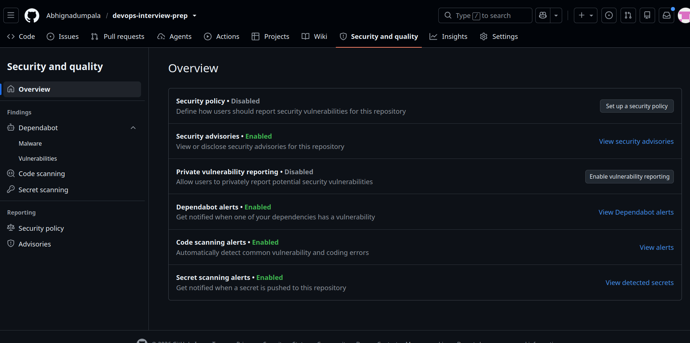

| Feature                | Status   | What it does                                         |
| ---------------------- | -------- | ---------------------------------------------------- |
| Dependabot alerts      | Enabled  | Alerts when a dependency has a known vulnerability   |
| Code scanning alerts   | Enabled  | CodeQL finds vulnerabilities in my code              |
| Secret scanning alerts | Enabled  | Alerts when a password / token is pushed to the repo |
| Security policy        | Disabled | A `SECURITY.md` telling people how to report issues  |

**2. CodeQL tool status — Code scanning → Tools → CodeQL**

Direct link: `https://github.com/<user>/<repo>/security/code-scanning/tools/CodeQL/status`

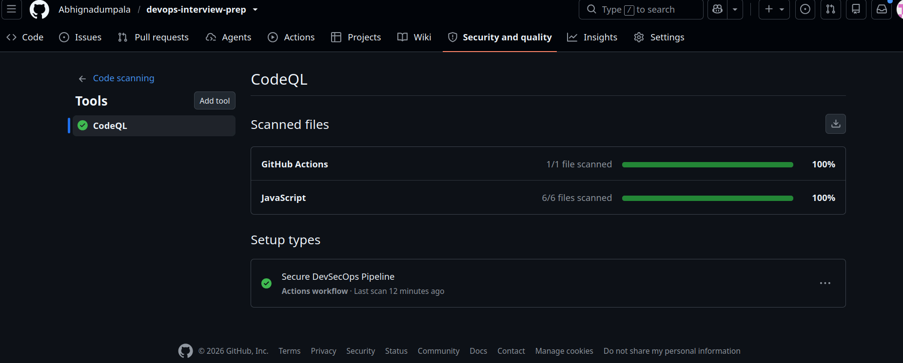

- **Scanned files:** what CodeQL checked. My repo: **GitHub Actions 1/1** (the workflow file) and
  **JavaScript 6/6** — 100% scanned.
- **Setup types:** **Secure DevSecOps Pipeline — Actions workflow** = CodeQL runs from my own YAML
  (Advanced setup), with the time of the last scan.

**3. Alerts — Security and quality → Code scanning**

Each alert shows the file, the line, how serious it is, and how to fix it. **No alerts = no known
vulnerabilities found.**

```
push → workflow runs CodeQL → results uploaded → Security and quality → Code scanning
```

## Self-Hosted Runners

A **self-hosted runner** is a machine (VM / server) **managed by your organization** that runs
GitHub Actions jobs, instead of GitHub's own machines.

**In short:** self-hosted runner = **your machine, your control**. GitHub still controls the
workflow; your machine just runs the jobs.

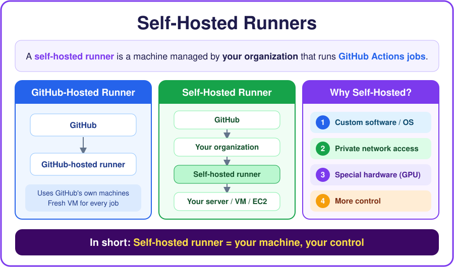

### Why Use Self-Hosted Runners?

Organizations may need:

1. **Custom software** — a special OS or tools that GitHub's machines don't have
2. **Private network access** — reach private databases or servers inside the company network
3. **Special hardware** — GPU, more RAM, more CPU
4. **More control** — choose the machine, OS, security rules, and where the code runs

### GitHub-Hosted vs Self-Hosted

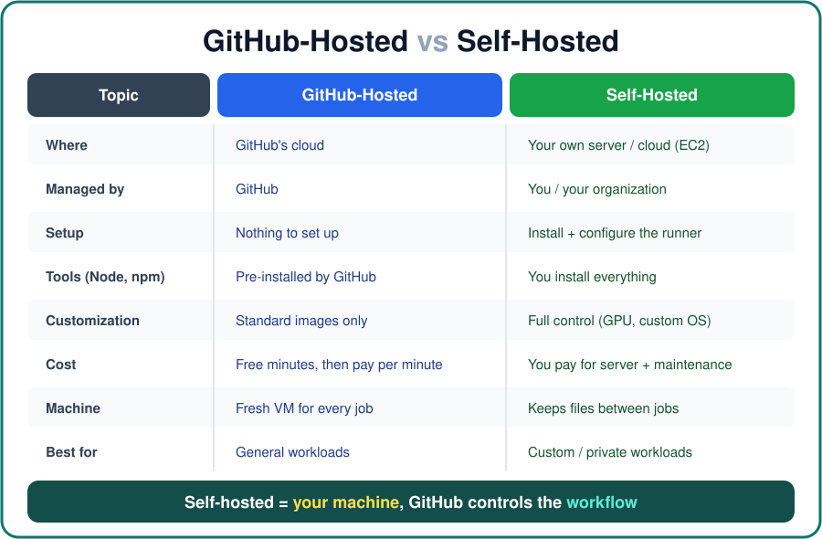

|               | GitHub-Hosted                      | Self-Hosted                       |
| ------------- | ---------------------------------- | --------------------------------- |
| Where         | GitHub's cloud                     | Your own server / cloud (EC2)     |
| Managed by    | GitHub                             | You / your organization           |
| Setup         | Easy, nothing to set up            | Needs setup and maintenance       |
| Tools         | Node, npm, git already installed   | You install everything            |
| Customization | Standard environments only         | Full control (GPU, custom OS…)    |
| Cost          | Free minutes in plan, limits apply | You pay for servers + maintenance |
| Machine       | Fresh VM for every job             | Keeps files between jobs          |
| Best for      | General workloads                  | Custom / private workloads        |

### Set Up a Self-Hosted Runner on AWS EC2

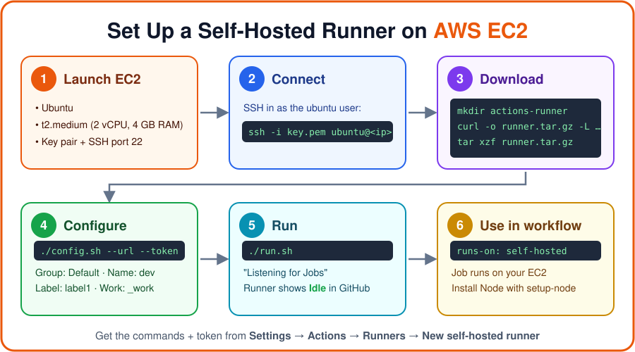

**Step 1 — Launch an EC2 instance**

- OS: **Ubuntu**
- Type: **t2.medium** at least (2 vCPU, **4 GB RAM**). Smaller machines run out of memory during
  `npm ci` and tests.
- Key pair for SSH, and a security group with **SSH (port 22)** open.
- No other inbound port is needed. The runner connects **out** to GitHub over HTTPS.

My instance `sel-host-runner` — **t2.medium**, **Running**:

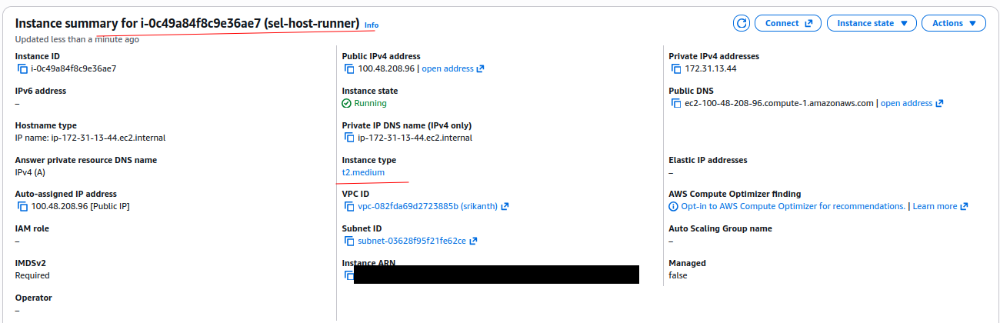

**Step 2 — Connect as the `ubuntu` user**

```bash
ssh -i my-key.pem ubuntu@<EC2_PUBLIC_IP>
```

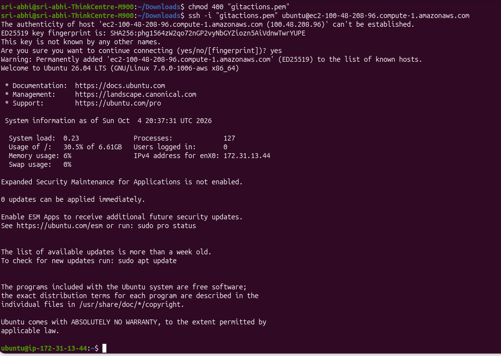

**Step 3 — Download the runner**

Copy these from **Repo → Settings → Actions → Runners → New self-hosted runner → Linux x64**.

```bash
# Create a folder
mkdir actions-runner && cd actions-runner

# Download the latest runner package
curl -o actions-runner-linux-x64-2.337.0.tar.gz -L https://github.com/actions/runner/releases/download/v2.337.0/actions-runner-linux-x64-2.337.0.tar.gz

# Optional: validate the hash
echo "70920811a4f8ad4328818682bca5c6469c1c942fab52448868071d0063816613  actions-runner-linux-x64-2.337.0.tar.gz" | shasum -a 256 -c

# Extract the installer
tar xzf ./actions-runner-linux-x64-2.337.0.tar.gz
```

The hash check prints **OK**, so the download is not corrupted:

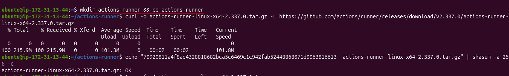

**Step 4 — Configure (connect the machine to my GitHub repo)**

Before this step, the repo has no self-hosted runners:

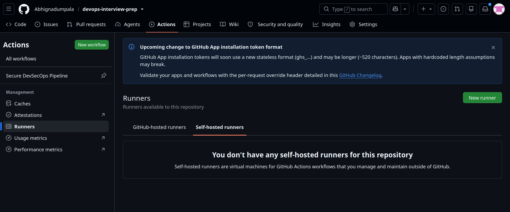

```bash
./config.sh --url https://github.com/Abhignadumpala/devops-interview-prep --token <YOUR_TOKEN>
```

> The token comes from the same GitHub page. It **expires in 1 hour** and is a secret, so never
> commit it.

Answers I gave:

| Question          | Answer                  |
| ----------------- | ----------------------- |
| Runner group      | Press Enter → `Default` |
| Runner name       | `dev`                   |
| Additional labels | `label1`                |
| Work folder       | Press Enter → `_work`   |

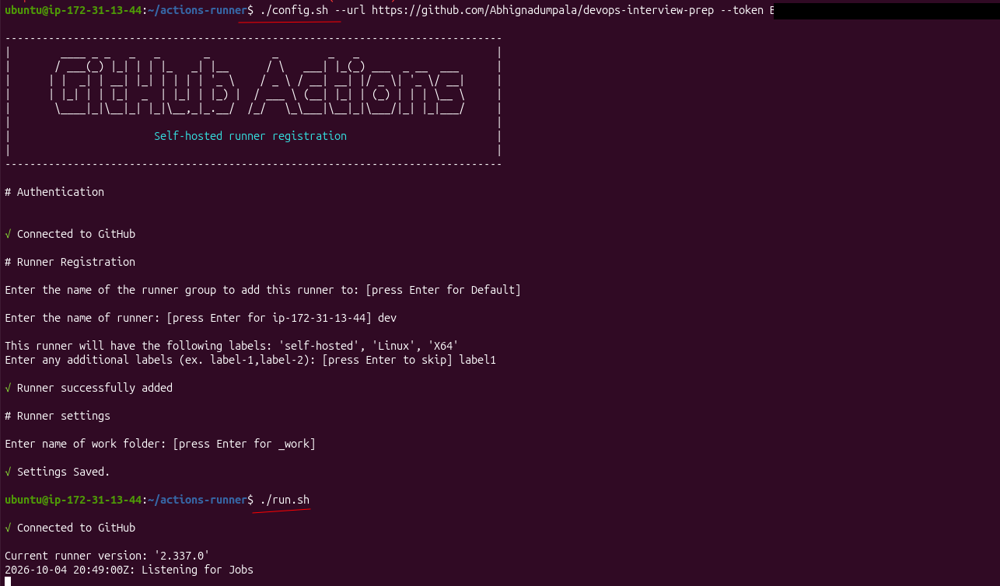

**Step 5 — Run it**

```bash
./run.sh
```

- The terminal shows **"Connected to GitHub"** and **"Listening for Jobs"**.
- In **Settings → Actions → Runners**, the runner `dev` shows as **Idle** (green).

  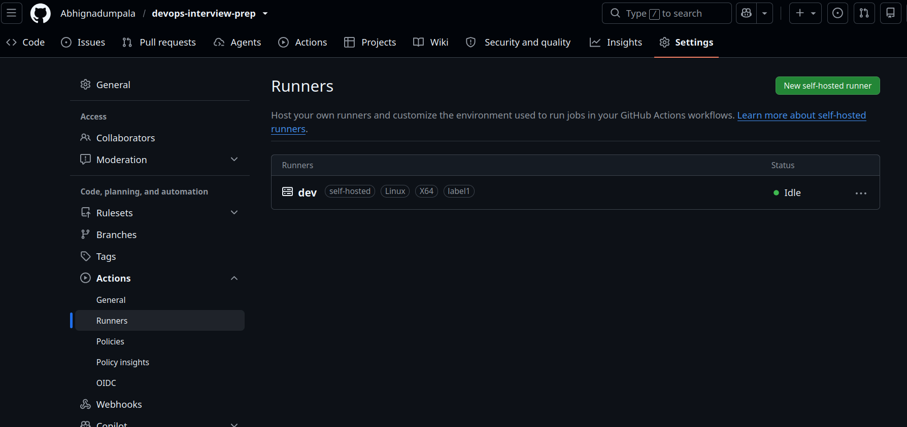

- `run.sh` stops when you close the terminal. To keep it running in the background, install it as a
  service: `sudo ./svc.sh install && sudo ./svc.sh start`.

### Use the Self-Hosted Runner in a Workflow

Use this in each job that should run on my machine:

```yaml
runs-on: self-hosted
```

**Important:** a GitHub-hosted runner already has Node.js and npm installed. My EC2 machine is
**empty**, so the job **fails** with `npm: command not found`. Fix: install Node.js **in the
pipeline** with `actions/setup-node`.

File: `.github/workflows/self-hosted.yml`

```yaml
name: Self-Hosted Runner Build

on:
  push:
    branches: [main]
  workflow_dispatch:

permissions:
  contents: read # read-only access to the repo

jobs:
  build:
    runs-on: self-hosted # or [self-hosted, label1] to pick a runner by label
    steps:
      - name: Checkout Repository
        uses: actions/checkout@v4

      - name: Setup Node.js
        uses: actions/setup-node@v4
        with:
          node-version: '20' # Node.js version to install
          cache: 'npm' # caches npm packages for faster runs

      - name: Install Dependencies
        run: npm ci

      - name: Test
        run: npm test

      - name: Build
        run: npm run build
```

```
push → GitHub → my EC2 runner (dev) → checkout → setup Node → npm ci → test → build
```

**Result:** I pushed to `main`, and the jobs ran **on my EC2 machine**. The runner terminal shows
`Running job: build` → `Job build completed with result: Succeeded` ✅

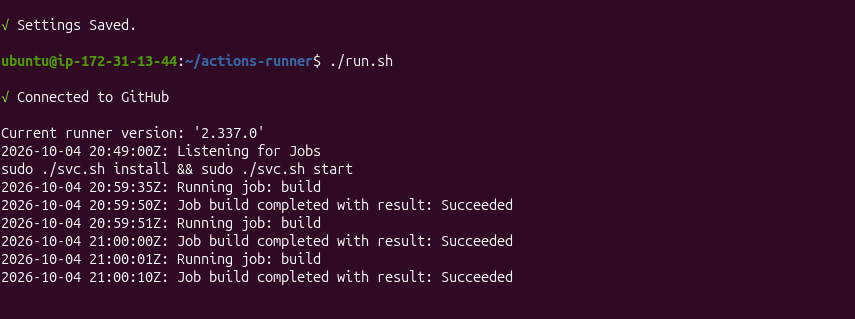

### Things to Remember

- **Self-hosted = install everything yourself.** GitHub-hosted = GitHub gives you the tools.
- The machine **keeps its files between runs** (GitHub-hosted runners start clean every time).
- ⚠️ Use self-hosted runners only on **private repos**. On a public repo, anyone can open a PR and
  run code on your machine.
- **Stop the EC2 instance** when you're done, so it doesn't keep costing money.

**Interview one-liner:** A self-hosted runner is a machine managed by the organization that executes
GitHub Actions jobs instead of using GitHub-hosted infrastructure.
