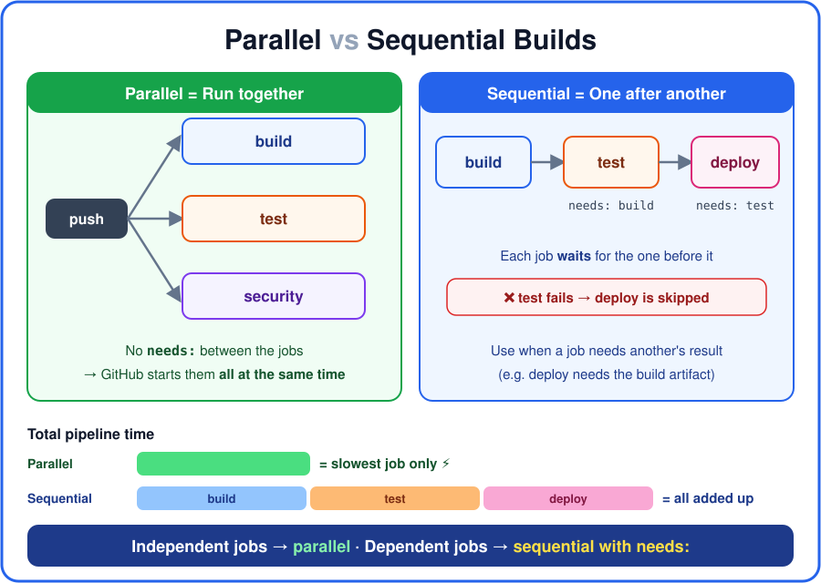
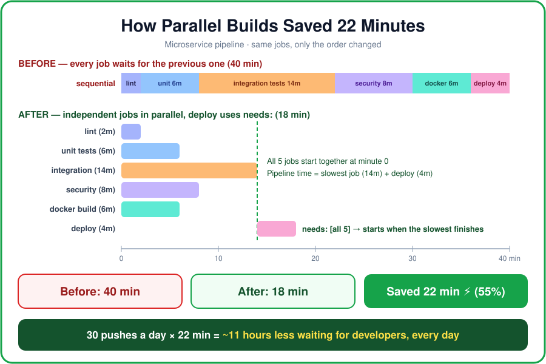
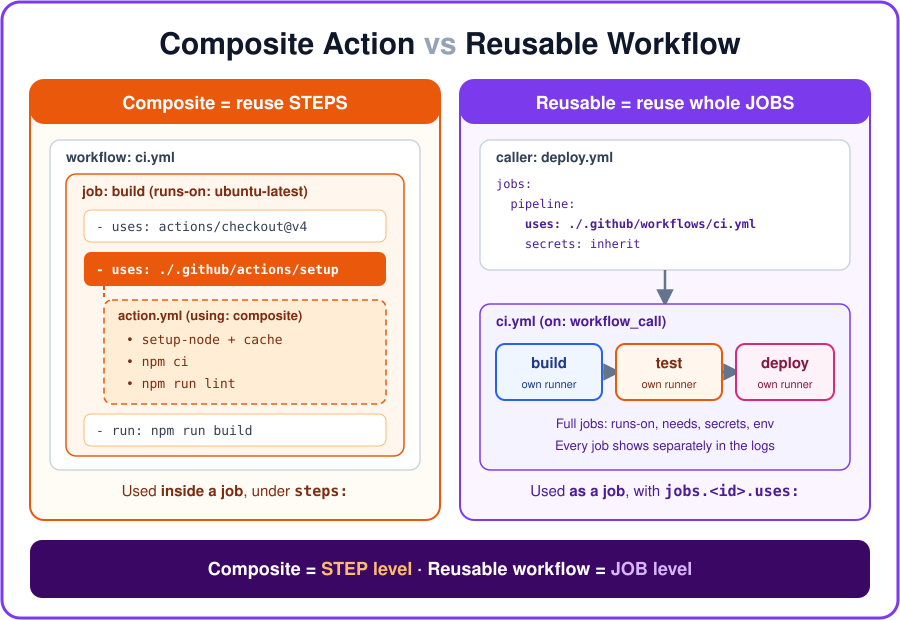
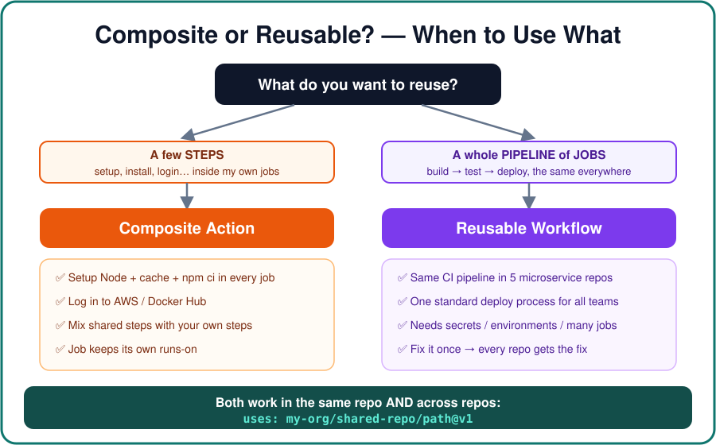

# Day 4 — Parallel & Sequential Builds, Composite Actions vs Reusable Workflows

[← Day 3](../day-3/README.md) · [All notes](../README.md)

- **Parallel builds:** independent jobs (build, test, security) run at the same time.
- **Sequential builds:** used `needs:` to run jobs in order: build → test → deploy.
- **Composite action:** bundled repeated **steps** into one reusable step.
- **Reusable workflow:** reused a whole **pipeline of jobs** from another workflow.

<!-- toc -->

## Table of Contents

- [1. Parallel Builds](#1-parallel-builds)
- [2. Sequential Builds](#2-sequential-builds)
- [3. Parallel vs Sequential Builds](#3-parallel-vs-sequential-builds)
  - [Mixing Both](#mixing-both)
  - [Scenarios — How I Made CI/CD Faster](#scenarios--how-i-made-cicd-faster)
- [4. Composite Action](#4-composite-action)
- [5. Reusable Workflow](#5-reusable-workflow)
- [6. Composite vs Reusable](#6-composite-vs-reusable)
- [7. When to Use What](#7-when-to-use-what)
  - [Common Mix-Up](#common-mix-up)
- [Interview One-Liners](#interview-one-liners)

<!-- tocstop -->



## 1. Parallel Builds

**Parallel builds** = running **multiple jobs at the same time**, instead of waiting for one job to
finish before starting the next.

If jobs **don't depend on each other**, GitHub Actions runs them **simultaneously** — this is the
**default**. You don't need any keyword.

```yaml
jobs:
  build: # no needs: → starts immediately
    runs-on: ubuntu-latest
    steps:
      - run: echo "Building..."

  test: # no needs: → starts immediately
    runs-on: ubuntu-latest
    steps:
      - run: echo "Testing..."

  security: # no needs: → starts immediately
    runs-on: ubuntu-latest
    steps:
      - run: echo "Scanning..."
```

Here, **build, test and security run in parallel**, each on its own runner.

**Why use parallel builds?**

- Reduces pipeline execution time (total time = the **slowest** job, not all jobs added up)
- Improves CI/CD speed → faster feedback for developers
- Lets independent tasks run simultaneously
- Very useful for large projects with many checks

**Interview one-liner:** Parallel builds run independent jobs simultaneously to reduce the overall
CI/CD pipeline execution time.

> **Parallel = Run together.**

## 2. Sequential Builds

**Sequential builds** = running jobs **one after another** in a specific order. A job starts only
after the job it depends on has **finished successfully**.

GitHub Actions uses the **`needs`** keyword to create this dependency.

```yaml
jobs:
  build:
    runs-on: ubuntu-latest
    steps:
      - run: echo "Building..."

  test:
    needs: build # waits for build
    runs-on: ubuntu-latest
    steps:
      - run: echo "Testing..."

  deploy:
    needs: test # waits for test
    runs-on: ubuntu-latest
    steps:
      - run: echo "Deploying..."
```

```
build ──► test ──► deploy
```

**Why use sequential builds?** When one task depends on the **output or success** of another task.

- You can't test code that hasn't been built.
- You must **never deploy** code whose tests failed.
- If `test` fails ❌, `deploy` is **skipped** automatically.

**Interview one-liner:** Sequential builds execute jobs one after another when there is a dependency
or required order between jobs.

> **Sequential = One after another.**

## 3. Parallel vs Sequential Builds

This is a very common interview question.

|                    | Parallel                    | Sequential                     |
| ------------------ | --------------------------- | ------------------------------ |
| **How jobs run**   | At the same time            | One after another              |
| **Speed**          | Faster                      | Can take longer                |
| **Used for**       | Independent jobs            | Jobs that depend on each other |
| **Keyword**        | Nothing — default behaviour | `needs:`                       |
| **If a job fails** | Other jobs keep running     | Later jobs are skipped         |
| **Example**        | build + test + security     | build → test → deploy          |

### Mixing Both

Real pipelines use **both**. Run the independent checks in parallel, then wait for all of them
before deploying:

```yaml
jobs:
  lint: # ┐
  test: # ├─ parallel (no needs)
  security: # ┘
  deploy:
    needs: [lint, test, security] # sequential: waits for all three
```

```
        ┌── lint ──────┐
push ───┼── test ──────┼──► deploy
        └── security ──┘
```

### Scenarios — How I Made CI/CD Faster

**The rule:** jobs that run **one after another** take the time of **all jobs added up**. Jobs that
run **in parallel** take the time of the **slowest job** only.

#### Real result from this repo — Matrix tests: 120 s → 32 s

On Day 2 I ran the tests on **2 OS × 3 Node versions = 6 jobs**.

| How the 6 test jobs ran | Time      |
| ----------------------- | --------- |
| One after another       | 120 s     |
| In parallel (matrix)    | **32 s**  |
| **Saved**               | **~88 s** |

#### Scenario 1 — Small Node.js app: saved ~55 seconds per push

**Problem:** I chained every job with `needs:`, so each job waited for the one before, even when it
didn't need its result.

```yaml
# BEFORE — everything sequential
jobs:
  lint: # 30 s
  test:
    needs: lint # 45 s — waits for lint for no reason
  security:
    needs: test # 25 s — npm audit, waits for test for no reason
  build:
    needs: security # 20 s
```

```
lint 30s ──► test 45s ──► security 25s ──► build 20s       = 120 s
```

**Question I asked:** _"Does test really need lint's result? Does security need test's result?"_ →
**No.** They only read the source code. Only `build` must wait, because we should never build code
that failed the checks.

```yaml
# AFTER — independent checks in parallel, build waits for all
jobs:
  lint: # 30 s ┐
  test: # 45 s ├─ run together
  security: # 25 s ┘
  build:
    needs: [lint, test, security] # 20 s
```

```
lint     30s ─┐
test     45s ─┼──► build 20s        = 45 s (slowest) + 20 s = 65 s
security 25s ─┘
```

| Before | After    | Saved                    |
| ------ | -------- | ------------------------ |
| 120 s  | **65 s** | **55 s per push (~45%)** |

#### Scenario 2 — Large microservice: saved ~22 minutes per run



**Problem:** a big microservice had a **40-minute** pipeline. Developers pushed code and waited
almost an hour for feedback, and hotfixes were slow to reach production.

| Job               | Time   | Does it need another job's result? |
| ----------------- | ------ | ---------------------------------- |
| lint              | 2 min  | No                                 |
| unit tests        | 6 min  | No                                 |
| integration tests | 14 min | No                                 |
| security scan     | 8 min  | No                                 |
| docker build      | 6 min  | No                                 |
| deploy            | 4 min  | **Yes — needs all of the above**   |

**Before (all sequential):** 2 + 6 + 14 + 8 + 6 + 4 = **40 min**

**After:** the 5 independent jobs run in parallel, and only `deploy` uses `needs:`.

```yaml
jobs:
  lint:
  unit-tests:
  integration-tests:
  security-scan:
  docker-build:
  deploy:
    needs: [lint, unit-tests, integration-tests, security-scan, docker-build]
```

**After:** slowest job (integration, 14 min) + deploy (4 min) = **18 min**

| Before | After      | Saved                     |
| ------ | ---------- | ------------------------- |
| 40 min | **18 min** | **22 min per run (~55%)** |

**Business impact:** the team pushes ~30 times a day → 30 × 22 min = **~11 hours less waiting every
day**. Faster feedback, faster hotfixes, happier developers.

**Going further:** integration tests (14 min) were now the slowest job. I split them into **3
parallel shards** with a matrix (~5 min each). The slowest job became the security scan (8 min), so
the total dropped to 8 + 4 = **~12 min**.

```yaml
integration-tests:
  runs-on: ubuntu-latest
  strategy:
    matrix:
      shard: [1, 2, 3]
  steps:
    - run: npm run test:integration -- --shard=${{ matrix.shard }}/3
```

#### When Parallel Does NOT Help

- **The job really needs another job's output** → keep `needs:` (e.g. deploy needs the build
  artifact). Correct order matters more than speed.
- **Very tiny jobs:** each job gets a **new runner**, and starting it + checkout + `npm ci` costs
  ~15–30 s. Splitting a 5-second task into its own job can make the pipeline **slower**. Keep tiny
  tasks as steps in one job.
- **Parallel saves waiting time, not billed minutes.** 5 jobs × their minutes are still charged —
  usually a bit more because each job repeats its setup. Use **cache** to keep setup fast.
- **Limits:** the number of jobs that can run at once depends on your plan and runners. Too many
  jobs just wait in the queue.

#### How to Answer in an Interview (STAR)

> **Situation:** Our microservice pipeline took **40 minutes**. Every job was chained with `needs:`,
> so developers waited almost an hour for feedback.
>
> **Task:** Reduce the pipeline time without skipping any checks.
>
> **Action:** I checked which jobs actually depended on each other. Lint, unit tests, integration
> tests, security scan and Docker build only needed the source code, so I removed the unnecessary
> `needs:` and ran them **in parallel**. Only deploy kept `needs:` on all of them. Then I split the
> slowest job, integration tests, into 3 shards with a matrix, and added npm caching.
>
> **Result:** The pipeline went from **40 minutes to ~12 minutes** — about **70% faster** — with the
> same checks and the same safety. Developers got feedback in minutes instead of nearly an hour.

**Tip:** the numbers above are example numbers for the story. Use your **real numbers** from the
**Actions** tab, which shows the duration of every job and the total time of each run.

## 4. Composite Action

A **composite action** bundles **several steps** into **one step** that you can reuse.

**Problem:** the same steps (setup Node → install dependencies) are copy-pasted in every job and
every workflow. **Solution:** put them in a composite action once, and call it with one line.

**Folder structure:**

```
my-repo/
└── .github/
    ├── actions/
    │   └── setup/
    │       └── action.yml   ← composite action
    └── workflows/
        ├── ci.yml           ← uses it
        └── deploy.yml       ← uses it too
```

**File: `.github/actions/setup/action.yml`**

```yaml
name: 'Setup Node and Install'
description: 'Install Node.js and npm dependencies'

inputs:
  node-version:
    description: 'Node.js version to install'
    required: false
    default: '20'

runs:
  using: composite # ← makes this a composite action
  steps:
    - uses: actions/setup-node@v4
      with:
        node-version: ${{ inputs.node-version }}
        cache: 'npm'

    - run: npm ci
      shell: bash # every run: step needs a shell in a composite action
```

**Using it in a workflow** (under `steps:`):

```yaml
jobs:
  build:
    runs-on: ubuntu-latest
    steps:
      - uses: actions/checkout@v4 # checkout first, so the action file exists
      - uses: ./.github/actions/setup # ← composite action = one step
        with:
          node-version: '22'
      - run: npm run build
```

**Things to remember:**

- Lives in an **`action.yml`** file with `runs: using: composite`.
- Called **inside a job**, under `steps:` — it is just **one step** in the job.
- Every `run:` step needs `shell:` (e.g. `shell: bash`).
- For a local action (`./.github/...`) you must run **`actions/checkout` first**.
- It can't read `secrets` directly — pass them in as **inputs**.

## 5. Reusable Workflow

A **reusable workflow** is a **whole workflow** (with jobs, runners and steps) that **another
workflow can call** — like calling a function.

**Problem:** 5 microservice repos each have their own copy of the same build → test → deploy
pipeline. A fix has to be made 5 times. **Solution:** write the pipeline **once** as a reusable
workflow, and every repo calls it.

**File: `.github/workflows/reusable-ci.yml`** (the workflow being reused)

```yaml
name: Reusable CI

on:
  workflow_call: # ← makes this workflow callable by others
    inputs:
      node-version:
        type: string
        default: '20'
    secrets:
      DEPLOY_TOKEN:
        required: false

jobs:
  build:
    runs-on: ubuntu-latest
    steps:
      - uses: actions/checkout@v4
      - uses: actions/setup-node@v4
        with:
          node-version: ${{ inputs.node-version }}
          cache: 'npm'
      - run: npm ci
      - run: npm run build

  test:
    needs: build
    runs-on: ubuntu-latest
    steps:
      - uses: actions/checkout@v4
      - run: npm ci
      - run: npm test
```

**File: `.github/workflows/deploy.yml`** (the caller)

```yaml
name: Deploy

on:
  push:
    branches: [main]

jobs:
  ci:
    uses: ./.github/workflows/reusable-ci.yml # same repo
    # uses: my-org/shared-workflows/.github/workflows/reusable-ci.yml@v1  ← other repo
    with:
      node-version: '22'
    secrets: inherit # pass the caller's secrets through
```

**Things to remember:**

- Has the trigger **`on: workflow_call`**.
- Called **as a job**: `jobs.<job_id>.uses:` — **not** inside `steps:`.
- The calling job has **no `runs-on` and no `steps`** — the reusable workflow defines them.
- Supports **inputs** (`with:`) and **secrets** (`secrets:` or `secrets: inherit`).
- Every job inside shows up **separately in the logs**.

## 6. Composite vs Reusable



|                         | Composite Action                  | Reusable Workflow                     |
| ----------------------- | --------------------------------- | ------------------------------------- |
| **What is it?**         | **Steps** bundled together        | **Jobs** (an entire workflow)         |
| **Level**               | Operates at **STEP** level        | Operates at **JOB** level             |
| **Used in**             | Within a job (`steps:`)           | Between workflows (`jobs.<id>.uses:`) |
| **File**                | `action.yml` + `using: composite` | workflow `.yml` + `on: workflow_call` |
| **Runner**              | Uses the **caller job's** runner  | Each job picks **its own** `runs-on`  |
| **Secrets**             | Only via inputs                   | `secrets:` or `secrets: inherit`      |
| **Logs**                | Shows as **one step**             | Every job and step shown separately   |
| **Mix with own steps?** | ✅ Yes — add steps before/after   | ❌ No — the whole job is the workflow |

**Simple analogy (cooking 🍳):**

- **Composite action** = a **pre-made spice mix**. You still cook your own dish (job), you just add
  the mix as one ingredient (step).
- **Reusable workflow** = a **full ready-made recipe** with all its stages. You just say "make this
  recipe" and it does everything.

## 7. When to Use What



| Situation                                                   | Use                   |
| ----------------------------------------------------------- | --------------------- |
| Same 2–3 setup steps repeated in many jobs                  | **Composite action**  |
| Log in to AWS / Docker Hub the same way everywhere          | **Composite action**  |
| Want shared steps **plus** your own steps in the same job   | **Composite action**  |
| Same full CI/CD pipeline in many microservice repos         | **Reusable workflow** |
| One standard, approved deploy process for all teams         | **Reusable workflow** |
| Need several jobs, different runners, secrets, environments | **Reusable workflow** |

**Rule of thumb:**

```
Need to reuse something?
│
├─ A few STEPS (inside my own job)?        → Composite action
│
└─ A whole PIPELINE of JOBS?               → Reusable workflow
```

### Common Mix-Up

❌ **Wrong:** "Composite = same repo only, Reusable = other repos."

✅ **Right:** the difference is **steps vs jobs**, not same repo vs other repo. **Both** can be used
in the same repo **and** shared across repos:

|               | Same repo                                   | Another repo                                                         |
| ------------- | ------------------------------------------- | -------------------------------------------------------------------- |
| **Composite** | `uses: ./.github/actions/setup`             | `uses: my-org/shared-actions/setup@v1`                               |
| **Reusable**  | `uses: ./.github/workflows/reusable-ci.yml` | `uses: my-org/shared-workflows/.github/workflows/reusable-ci.yml@v1` |

For another repo, it must be **public**, or the private repo must **allow access** in
_Settings → Actions → General → Access_. Always pin a version (`@v1`, a tag or a commit SHA).

> **Related idea outside GitHub Actions:** a **Terraform module** is also "write once, reuse
> everywhere" — the same thinking as a reusable workflow, but for infrastructure.

## Interview One-Liners

- **Parallel builds** run independent jobs simultaneously to reduce the overall pipeline time.
- **Sequential builds** run jobs one after another using `needs:` when there is a dependency between
  them.
- A **composite action** bundles multiple **steps** into one reusable step that runs inside a job.
- A **reusable workflow** is an entire workflow of **jobs**, triggered by `workflow_call`, that
  other workflows call at the job level.
- **Composite = STEP level, Reusable workflow = JOB level.** Use composite to remove repeated steps;
  use a reusable workflow to standardise a whole pipeline across repos and teams.
