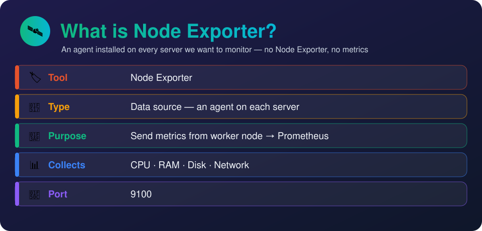
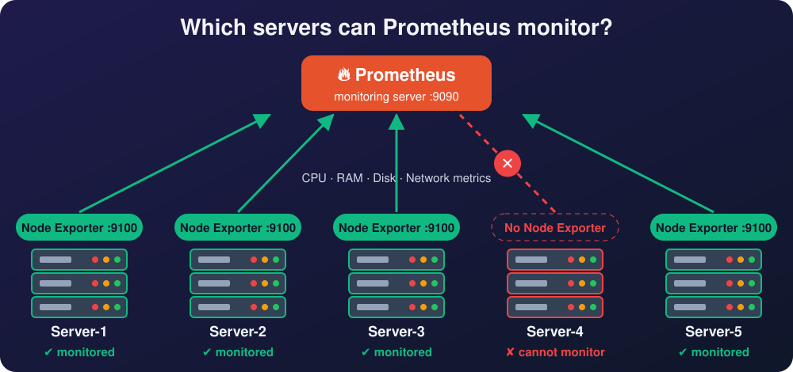

# Day 1 — Intro to Monitoring

[← All notes](../README.md) · [Day 2 →](../day-2-service-discovery/README.md)

## What is Monitoring?

**Monitoring** = analysing the **performance** of our servers and applications using **metrics**
like CPU, memory and disk.

**Why?**

- Find problems **before users do** (high CPU, full disk, server down).
- **Alert** the team when something goes wrong.
- See **trends** — when to add more servers.

## Monitoring Tools

There are many monitoring tools in the market. The most used (free & open source) are **Prometheus**
and **Grafana**.

| Tool           | In short                                 |
| -------------- | ---------------------------------------- |
| **Prometheus** | Collects and stores metrics from servers |
| **Grafana**    | Shows those metrics as dashboards        |

```
Servers ──metrics──► Prometheus ──► Grafana (dashboards)
```

> **Prometheus collects the data. Grafana shows the data.**

## What is Prometheus?


**Prometheus** = a free & open-source tool to **monitor servers**, mainly used for **cloud-native
applications**.

| Field              | In short                                                      |
| ------------------ | ------------------------------------------------------------- |
| **Type**           | Free & open source                                            |
| **Mainly for**     | Cloud-native applications                                     |
| **Purpose**        | Monitor servers                                               |
| **Monitors**       | **Metrics** — CPU, RAM, disk usage… anything that is a number |
| **Stores data in** | **TSDB** — Time Series Database                               |
| **To show data**   | **PromQL** — Prometheus Query Language                        |
| **Alerts**         | **Alertmanager** → email, mobile, Slack when things go wrong  |
| **Port**           | **9090**                                                      |

**Alert example:** CPU goes **above 90%** → Alertmanager sends an email / Slack / mobile alert.

## What is Node Exporter?



**Node Exporter** = an **agent** we install on a server to **collect its metrics** (CPU, RAM, disk,
network) and **send them to Prometheus**.

| Field       | In short                                   |
| ----------- | ------------------------------------------ |
| **Type**    | Data source (agent)                        |
| **Purpose** | Send metrics from worker node → Prometheus |
| **Port**    | **9100**                                   |

**No Node Exporter → no metrics → we can't monitor that server.**



Servers 1, 2, 3 and 5 have Node Exporter → **monitored**. Server 4 doesn't → **cannot be monitored**.

> **First step:** install Node Exporter on **every server you want to monitor**.

## Lab — Monitor an EC2 Server

```
┌─ Worker node (EC2) ──────────┐          ┌─ prometheus-monitoring-server (EC2) ─┐
│ Amazon sample app   :80      │  metrics │ Prometheus  :9090  (stores in TSDB)  │
│ Node Exporter       :9100    │ ───────► │ Grafana     :3000  (dashboards)      │
└──────────────────────────────┘   (pull) └──────────────────────────────────────┘
```

| Server                           | Installed                  | Security group ports                     |
| -------------------------------- | -------------------------- | ---------------------------------------- |
| **Worker node**                  | Amazon app + Node Exporter | 22, **80**, **9100**                     |
| **prometheus-monitoring-server** | Prometheus + Grafana       | 22, **9090**, **3000** (`monitoring-sg`) |

**Worker node SG**

| Type       | Port | Source                                                   | Why                            |
| ---------- | ---- | -------------------------------------------------------- | ------------------------------ |
| SSH        | 22   | My IP                                                    | You log in                     |
| HTTP       | 80   | 0.0.0.0/0 (Anywhere)                                     | Anyone can open the Amazon app |
| Custom TCP | 9100 | `monitoring-sg` (or Prometheus server's private IP/32)   | Only Prometheus pulls metrics  |

**prometheus-monitoring-server SG (`monitoring-sg`)**

| Type       | Port | Source | Why                           |
| ---------- | ---- | ------ | ----------------------------- |
| SSH        | 22   | My IP  | You log in                    |
| Custom TCP | 9090 | My IP  | Prometheus UI in your browser |
| Custom TCP | 3000 | My IP  | Grafana UI in your browser    |

> Why HTTP for 80 but Custom TCP for 9090? → [Security Group Types — HTTP vs Custom TCP](../../aws/security-group-types/README.md)

### Part 1 — Worker Node: Amazon App

**1. Launch an EC2 (Ubuntu)** → under **Advanced details → User data**, paste this. It installs
nginx and serves a sample Amazon page when the server boots.

```bash
#!/bin/bash
apt update -y
apt install -y nginx

cat <<'EOF' > /var/www/html/index.html
<!DOCTYPE html>
<html lang="en">
<head>
  <meta charset="UTF-8">
  <title>Amazon Clone - Demo</title>
  <style>
    body { margin: 0; font-family: Arial, sans-serif; background: #eaeded; }
    header { background: #131921; color: #fff; padding: 12px 20px; display: flex; align-items: center; gap: 20px; }
    .logo { font-size: 26px; font-weight: bold; }
    .logo span { color: #ff9900; }
    .search { flex: 1; display: flex; }
    .search input { flex: 1; padding: 10px; border: none; border-radius: 4px 0 0 4px; }
    .search button { background: #febd69; border: none; padding: 0 16px; border-radius: 0 4px 4px 0; }
    nav { background: #232f3e; color: #fff; padding: 8px 20px; font-size: 14px; }
    .banner { background: linear-gradient(90deg, #ff9900, #febd69); text-align: center; padding: 40px; font-size: 28px; font-weight: bold; }
    .products { display: grid; grid-template-columns: repeat(auto-fit, minmax(200px, 1fr)); gap: 20px; padding: 20px; }
    .card { background: #fff; padding: 20px; border-radius: 6px; text-align: center; }
    .card .img { font-size: 60px; }
    .price { color: #b12704; font-size: 20px; font-weight: bold; }
    .card button { background: #ffd814; border: none; padding: 8px 16px; border-radius: 20px; cursor: pointer; }
    footer { background: #131921; color: #ccc; text-align: center; padding: 16px; font-size: 13px; }
  </style>
</head>
<body>
  <header>
    <div class="logo">amazon<span>.clone</span></div>
    <div class="search"><input placeholder="Search products"><button>🔍</button></div>
    <div>🛒 Cart</div>
  </header>
  <nav>All · Today's Deals · Electronics · Books · Fashion · Home</nav>
  <div class="banner">Great Indian Sale — Up to 70% off</div>
  <div class="products">
    <div class="card"><div class="img">📱</div><h3>Smartphone</h3><p class="price">₹14,999</p><button>Add to Cart</button></div>
    <div class="card"><div class="img">💻</div><h3>Laptop</h3><p class="price">₹54,999</p><button>Add to Cart</button></div>
    <div class="card"><div class="img">🎧</div><h3>Headphones</h3><p class="price">₹1,999</p><button>Add to Cart</button></div>
    <div class="card"><div class="img">⌚</div><h3>Smart Watch</h3><p class="price">₹3,499</p><button>Add to Cart</button></div>
  </div>
  <footer>Demo page for DevOps monitoring practice — served from EC2</footer>
</body>
</html>
EOF

systemctl enable nginx
systemctl restart nginx
```

**2. Security group** → allow **22** (SSH) and **80** (HTTP).

**3. Check** → open `http://<worker-ip>` → the Amazon page shows.

### Part 2 — Worker Node: Install Node Exporter

To collect **CPU, RAM, disk** metrics from the worker, install Node Exporter on it.

```bash
ssh -i <key.pem> ubuntu@<worker-ip>
sudo -i
vim node-exporter # paste the script below, save (Esc → :wq)
sh node-exporter
```

```bash
# download and extract
wget https://github.com/prometheus/node_exporter/releases/download/v1.5.0/node_exporter-1.5.0.linux-amd64.tar.gz
tar -xf node_exporter-1.5.0.linux-amd64.tar.gz

# move the binary and clean up
sudo mv node_exporter-1.5.0.linux-amd64/node_exporter /usr/local/bin
rm -rv node_exporter-1.5.0.linux-amd64*

# create a user for the service (no login)
sudo useradd -rs /bin/false node_exporter

# create the systemd service
sudo cat <<EOF | sudo tee /etc/systemd/system/node_exporter.service
[Unit]
Description=Node Exporter
After=network.target

[Service]
User=node_exporter
Group=node_exporter
Type=simple
ExecStart=/usr/local/bin/node_exporter

[Install]
WantedBy=multi-user.target
EOF

# start the service
sudo cat /etc/systemd/system/node_exporter.service
sudo systemctl daemon-reload && sudo systemctl enable node_exporter
sudo systemctl start node_exporter.service && sudo systemctl status node_exporter.service --no-pager
```

| Script step              | What it does                           |
| ------------------------ | -------------------------------------- |
| `wget` + `tar`           | Download and extract Node Exporter     |
| `mv … /usr/local/bin`    | Make `node_exporter` a command         |
| `useradd -rs /bin/false` | Create a system user that can't log in |
| `node_exporter.service`  | Run it as a service (starts on boot)   |
| `systemctl enable/start` | Start it now and on every reboot       |

**Allow port 9100** in the worker's security group → check `http://<worker-ip>:9100/metrics`.

### Part 3 — Why Prometheus?

**Problem:** Node Exporter only **exposes** metrics — it has **no database** to store them.

**Fix:** Prometheus **pulls** the metrics and **stores them on disk** in its **TSDB (Time Series
Database)**. So we need a separate **monitoring server**.

```
Node Exporter (no DB) ──metrics──► Prometheus (stores in TSDB) ──► Grafana (shows)
```

### Part 4 — Create the Monitoring Server

| Setting        | Value                                      |
| -------------- | ------------------------------------------ |
| Name           | `prometheus-monitoring-server`             |
| OS             | Ubuntu                                     |
| Security group | `monitoring-sg` → allow **22, 9090, 3000** |

| Port     | For        |
| -------- | ---------- |
| **9090** | Prometheus |
| **3000** | Grafana    |

### Part 5 — Install Prometheus

SSH into the monitoring server, switch to root:

```bash
vim monitoring.sh # paste the script below, save
sh monitoring.sh
```

```bash
# download and extract Prometheus
wget https://github.com/prometheus/prometheus/releases/download/v2.43.0/prometheus-2.43.0.linux-amd64.tar.gz
tar -xf prometheus-2.43.0.linux-amd64.tar.gz
sudo mv prometheus-2.43.0.linux-amd64/prometheus prometheus-2.43.0.linux-amd64/promtool /usr/local/bin

# create directories for config and data
sudo mkdir /etc/prometheus /var/lib/prometheus
sudo mv prometheus-2.43.0.linux-amd64/console_libraries /etc/prometheus
ls /etc/prometheus
sudo rm -rvf prometheus-2.43.0.linux-amd64*

# config: what to monitor (replace <worker-ip>)
sudo cat <<EOF | sudo tee /etc/prometheus/prometheus.yml
global:
  scrape_interval: 10s

scrape_configs:
  - job_name: 'prometheus_metrics'
    scrape_interval: 5s
    static_configs:
      - targets: ['localhost:9090']
  - job_name: 'node_exporter_metrics'
    scrape_interval: 5s
    static_configs:
      - targets: ['<worker-ip>:9100']
EOF

# create a user and give it the folders
sudo useradd -rs /bin/false prometheus
sudo chown -R prometheus: /etc/prometheus /var/lib/prometheus
sudo ls -l /etc/prometheus/

# create the systemd service
sudo cat <<EOF | sudo tee /etc/systemd/system/prometheus.service
[Unit]
Description=Prometheus
After=network.target

[Service]
User=prometheus
Group=prometheus
Type=simple
ExecStart=/usr/local/bin/prometheus \
    --config.file /etc/prometheus/prometheus.yml \
    --storage.tsdb.path /var/lib/prometheus/ \
    --web.console.templates=/etc/prometheus/consoles \
    --web.console.libraries=/etc/prometheus/console_libraries

[Install]
WantedBy=multi-user.target
EOF

# start Prometheus
sudo ls -l /etc/systemd/system/prometheus.service
sudo systemctl daemon-reload && sudo systemctl enable prometheus
sudo systemctl start prometheus && sudo systemctl status prometheus --no-pager
```

| Part                     | What it does                                     |
| ------------------------ | ------------------------------------------------ |
| `prometheus`, `promtool` | Prometheus server + config checker               |
| `/etc/prometheus`        | Config files                                     |
| `/var/lib/prometheus`    | **TSDB data** (metrics stored on disk)           |
| `prometheus.yml`         | **targets** = which servers to scrape, every 5 s |
| `prometheus.service`     | Runs Prometheus as a service                     |

### Part 6 — Install Grafana

```bash
vim grafana.sh # paste the script below, save
sh grafana.sh
```

```bash
sudo apt-get install -y adduser libfontconfig1
wget https://dl.grafana.com/enterprise/release/grafana-enterprise_9.4.7_amd64.deb
sudo dpkg -i grafana-enterprise_9.4.7_amd64.deb
sudo /bin/systemctl daemon-reload
sudo /bin/systemctl enable grafana-server
sudo /bin/systemctl start grafana-server
sudo /bin/systemctl status grafana-server --no-pager
```

### Part 7 — Open in Browser

| Open                              | You see                                    |
| --------------------------------- | ------------------------------------------ |
| `http://<worker-ip>`              | Amazon sample app                          |
| `http://<worker-ip>:9100/metrics` | Raw metrics from Node Exporter             |
| `http://<monitoring-ip>:9090`     | Prometheus → **Status → Targets** = **UP** |
| `http://<monitoring-ip>:3000`     | Grafana login (`admin` / `admin`)          |

> **Grafana default login:** username `admin`, password `admin` (it asks you to set a new one).

### Recap — Who Does What

| Tool              | Job                                               | Has a database? |
| ----------------- | ------------------------------------------------- | --------------- |
| **Node Exporter** | Collects metrics on the server we monitor         | ❌ No           |
| **Prometheus**    | Pulls and **saves** metrics in a **TSDB** on disk | ✅ Yes          |
| **Grafana**       | Shows the saved metrics as dashboards             | Uses Prometheus |

**Next problem:** how does Prometheus know **which server** to collect from? → add it as a
**target**.

### Part 8 — Connect the Worker to Prometheus (Targets)

On the **monitoring server**, open the Prometheus config:

```bash
vim /etc/prometheus/prometheus.yml
```

Under `targets`, add the **IP of the server you are monitoring** (the Amazon VM) with port **9100**:

```yaml
- job_name: "node_exporter_metrics"
  scrape_interval: 5s
  static_configs:
    - targets: ["<amazon-vm-ip>:9100"] # add more: ['ip1:9100', 'ip2:9100']
```

> **NOTE: After modifying the config of any service, we need to restart it.**

```bash
systemctl restart prometheus.service
```

**Check:** `http://<monitoring-ip>:9090` → **Status → Targets** → Amazon VM shows **UP** ✅.

```
Amazon VM (Node Exporter :9100) ──► target in prometheus.yml ──► restart ──► UP in Prometheus
```

### Part 9 — See the Data with PromQL Queries

Now **Node Exporter is sending data to the Prometheus server**. To **see** that data, we run
**queries**.

In Prometheus (`:9090`) → type the query in the search box → **Execute** → see **Table** or
**Graph**.

**First query — `up`** = shows the **number of servers running**.

```
up{instance="<amazon-vm-ip>:9100", job="node_exporter_metrics"}   1   ← running
up{instance="localhost:9090",      job="prometheus_metrics"}      1   ← running
```

`1` = server is **up**, `0` = server is **down**.

| To show                                  | Query                                              |
| ---------------------------------------- | -------------------------------------------------- |
| Which servers are running (1=up, 0=down) | `up`                                               |
| Total requests to the server             | `promhttp_metric_handler_requests_total`           |
| Requests in the last 1 minute            | `promhttp_metric_handler_requests_total[1m]`       |
| Requests **per second** (rate)           | `rate(promhttp_metric_handler_requests_total[1m])` |
| Memory                                   | `node_memory_Active_bytes`                         |
| CPU                                      | `node_cpu_seconds_total`                           |
| Disk                                     | `node_disk_info`                                   |

- `[1m]` = values from the **last 1 minute**.
- `rate(...)` = how fast it is increasing **per second**.

> **Scrape interval:** by default Prometheus collects new data **every 1 minute**. We can reduce it to
> **10 s or 15 s** with `scrape_interval` in `prometheus.yml` (we used `10s` / `5s`).

### Part 10 — Why Grafana?

**Problem:** in Prometheus, every time we want to see data we must **run a query**. Doing this again
and again is **time-taking** and not possible in **real time** — not ideal.

**Fix:** **Grafana** takes whatever data is in Prometheus and shows it as **visual dashboards** that
update **in real time** — no need to run queries each time.

```
Prometheus (stores data) ──► Grafana (live dashboards)
   run queries by hand          see everything visually, auto-updating
```

> **Purpose of Grafana = create dashboards.**

### Part 11 — Connect Prometheus to Grafana (Data Source)

**Data source** = tells Grafana **where the data is coming from** → here, Prometheus.

```
Login (admin / admin)
   ▼
Connections → Data sources → Add data source → Prometheus
   ▼
URL: http://<monitoring-ip>:9090/
   ▼
Save & test ✅ → "Data source is working"
```

Now **Prometheus can communicate with Grafana**.

### Part 12 — Create a Dashboard (Import by ID)

We don't build graphs by hand — we **import a ready-made dashboard** from the official
[Grafana dashboards](https://grafana.com/grafana/dashboards/) site using its **ID**.

```
Dashboards → New → Import
   ▼
"Import via grafana.com" → ID 1860 → Load
   ▼
Select data source: Prometheus → Import
```

- **1860 = Node Exporter Full** → Grafana downloads this dashboard **automatically** using the ID.
- You now see **live data** — CPU, memory, RAM, disk, network, even **how many processes are
  running** — each in its **own panel**.

**Other dashboard IDs to try** — import any you like the same way:

| ID                            |
| ----------------------------- |
| **1860** (Node Exporter Full) |
| 10180                         |
| 14731                         |
| 11074                         |
| 8919                          |

> By default, imported dashboards go into the **General** folder.

### Part 13 — Test with Load (`stress`)

On the **Amazon VM (worker)**, add load **on purpose** and watch the dashboard:

```bash
apt update && apt install stress -y && stress -c 10 # 10 CPU workers
```

- CPU panel goes **up** in Grafana — values keep changing **automatically**.
- Stop with `Ctrl + C` → CPU comes back **down**.

### Part 14 — Share Dashboards with Users (Roles)

In real time, other people in the organisation also need to see the dashboards. We create a
**user** for them.

**Create a user**

```
Login as admin → Administration → Users → New user
   ▼
Name: abhi, username, email, password → Create user
```

By default the new user gets the **Viewer** role → can **see** dashboards but **cannot edit**.

**Give edit access**

```
Login as admin → Administration → Users → abhi → Change role → Editor → Save
   ▼
Log out → login as abhi → can now edit the dashboard ✅
```

| Role       | Can do                                            |
| ---------- | ------------------------------------------------- |
| **Viewer** | Only **see** dashboards (default for new users)   |
| **Editor** | See + **create and edit** dashboards              |
| **Admin**  | Everything — manage users, data sources, settings |

### Full Flow

```
Amazon VM ──► Node Exporter :9100 ──► Prometheus :9090 (TSDB) ──► Grafana :3000 (dashboard 1860)
 (app)         collects metrics         stores + PromQL              live visual dashboards
```

## Interview One-Liner

Monitoring is analysing the performance of servers and applications using metrics like CPU, memory
and disk — most commonly with Prometheus and Grafana.

Prometheus is a free, open-source tool that monitors server metrics, stores them in a time series
database, queries them with PromQL and sends alerts through Alertmanager (port 9090).

Node Exporter is an agent installed on each server that exposes its CPU, RAM, disk and network
metrics on port 9100 for Prometheus to collect.

To monitor a server, add its `IP:9100` as a target in `prometheus.yml`, restart Prometheus, and
query its metrics with PromQL (e.g. `up`, `node_memory_Active_bytes`).

Grafana connects to Prometheus as a **data source** and shows its metrics as live dashboards, so we
don't have to run PromQL queries by hand — e.g. dashboard **1860 (Node Exporter Full)**.

New Grafana users get the **Viewer** role by default (see only); an admin can change it to
**Editor** (edit) or **Admin** (manage everything).
